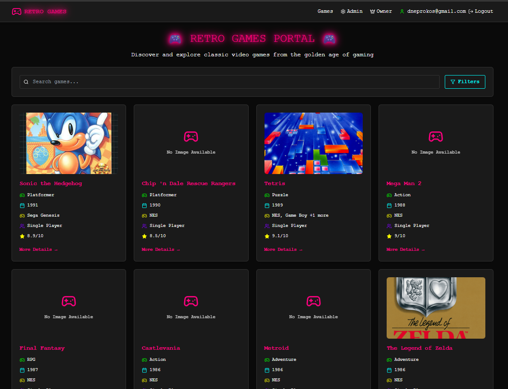

# 🎮 Retro Video Games Portal



A full-stack web application for managing and exploring retro video games. Designed to simulate a realistic web shop interface, the app includes various user roles, CRUD operations, and interactive UI components — ideal for automation testing practice.

---

## ✨ Features
- Browse, search, and filter a collection of classic retro games
- Role-based access: Guest, Admin, Owner
- Add, edit, and delete games (Admin/Owner)
- Owner can manage admin accounts
- JWT authentication & secure backend
- Modern retro-themed UI with responsive design
- MongoDB for persistent storage
- Swagger API documentation

---

## 📸 Screenshots


---

## 🏁 Getting Started (Local Dev)

```bash
# Frontend
cd client
npm install
npm start

# Backend
cd server
npm install
npm run dev
```

---

## 🧩 Tech Stack
- **Frontend**: React (with hooks & context)
- **Backend**: Node.js + Express
- **Database**: MongoDB (Mongoose ODM)
- **Auth**: JWT-based role access (Guest, Admin, Owner)

---

## 👥 User Roles & Permissions

| Role   | Description                                                                 |
|--------|-----------------------------------------------------------------------------|
| Guest  | Can browse, search, and view game details                                   |
| Admin  | Can add/edit game details (must be logged in); cannot manage other users   |
| Owner  | Full control: Can add/edit games AND manage admin accounts                 |

> 🛡️ Admins can only be created by Owner.

---

## 🔐 Authentication & Authorization
- JWT tokens for session control
- Protected routes for Admin and Owner features
- Role stored in JWT claims
- Passwords hashed using bcrypt

---

## 🎮 Game Model (MongoDB Schema)

| Field            | Type        | Validation                                | UI Element          |
|------------------|-------------|--------------------------------------------|----------------------|
| `name`           | String      | Required, Unique, Min 2 chars              | Text Field           |
| `genre`          | String      | Required, from predefined list             | Dropdown             |
| `platforms`      | [String]    | At least 1 selected                        | Checkbox group       |
| `releaseDate`    | Date        | Required, not in future                    | Date Picker          |
| `hasMultiplayer` | Boolean     | Required                                   | Radio buttons        |
| `description`    | String      | Optional, max 500 chars                    | Textarea             |
| `imageUrl`       | String      | Optional, valid URL                        | Text Field / Upload  |
| `rating`         | Number      | 0-10 scale (optional)                      | Range/Slider         |

> ✅ Default image shown if no image URL is provided  
> ✅ Duplicate names should be rejected with a clear validation message

---

## 🔍 Game Search / Filters

Guests, Admins, and Owners can:
- Search by game name (case-insensitive substring match)
- Filter by:
  - Release year range (slider or dropdown range)
  - Genre (dropdown)
  - Multiplayer (yes/no toggle)

---

## 📄 Game Card (Shown in Grid View)

Each game card should include:
- Image (or default if missing)
- Game name
- Genre
- Release year
- Platform(s) short list (e.g., "NES, SNES")
- "More Details" button

---

## 🗂 Game Details Page

Accessible by all users.
Includes:
- Full-size image
- Full description
- Platforms (list or icons)
- Multiplayer support (yes/no)
- Genre
- Rating (if exists)
- Release date

---

## ✏️ Admin Functionality

Admin panel should include:
- Add new game
- Edit existing game (by clicking Edit on detail page or list)
- Validations for:
  - All required fields filled
  - Name uniqueness
  - Image URL validity
  - Release date not in the future
- Drag-and-drop file uploader for game images (stored as URL or base64 locally)

---

## 👑 Owner Functionality

- All admin capabilities
- Additional:
  - Admin management screen:
    - View list of admins
    - Add new admin (email + password + confirm password)
    - Remove admin
  - Admin creation form with validation:
    - Unique email
    - Password (min 6 characters)
    - Confirm password match

---

## 📦 Optional Features (for extra challenge)
- Game ratings with stars
- Pagination or infinite scroll on game list
- Mobile responsiveness
- Unit tests for backend routes

---

## 🧪 Common UI Components Used
| Component          | Purpose                          |
|--------------------|----------------------------------|
| Text field         | Game name, image URL             |
| Textarea           | Description                      |
| Dropdown           | Genre, Year                      |
| Checkboxes         | Platform selection               |
| Radio buttons      | Multiplayer support              |
| Date picker        | Release date                     |
| File upload        | Game image                       |
| Range slider       | Rating, Release year filter      |
| Toasts/snackbars   | Success/error messages           |
| Dialog/Modal       | Confirm deletion/admin creation  |

---

## 🚫 Error & Validation Scenarios

- 🟥 Add Game: Name already exists → show `"Game with this name already exists."`
- 🟥 Edit Game: Validation errors show field-level messages
- 🟥 Release date in future → `"Release date cannot be in the future."`
- 🟥 Image URL invalid → `"Please enter a valid URL or upload an image."`
- 🟥 Add Admin: Passwords don’t match → `"Passwords must match"`
