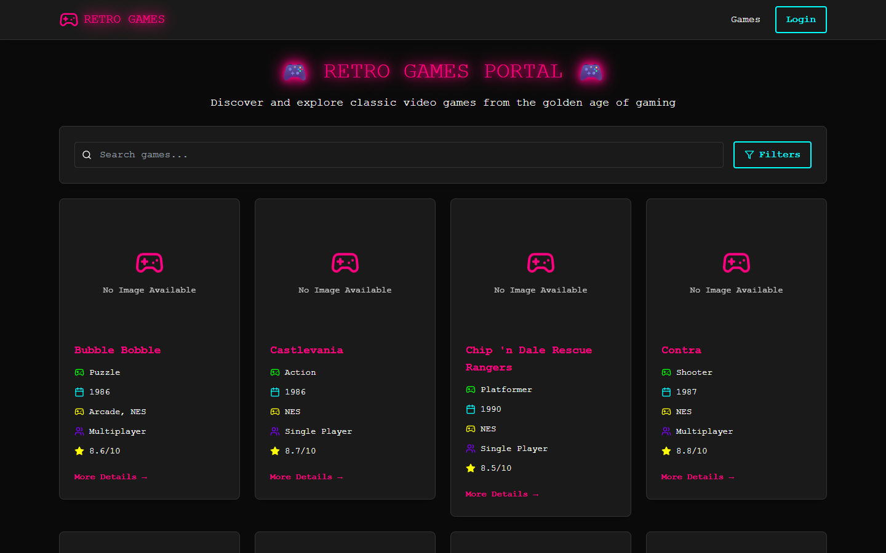
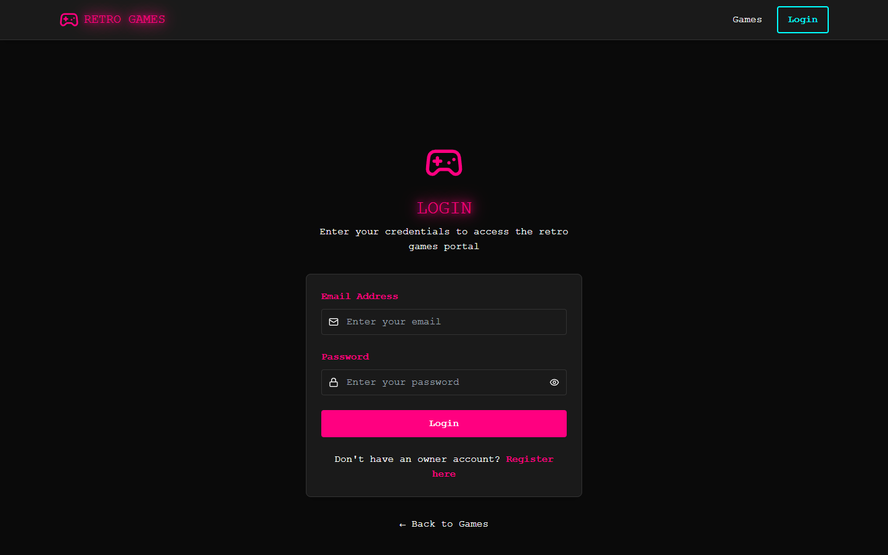
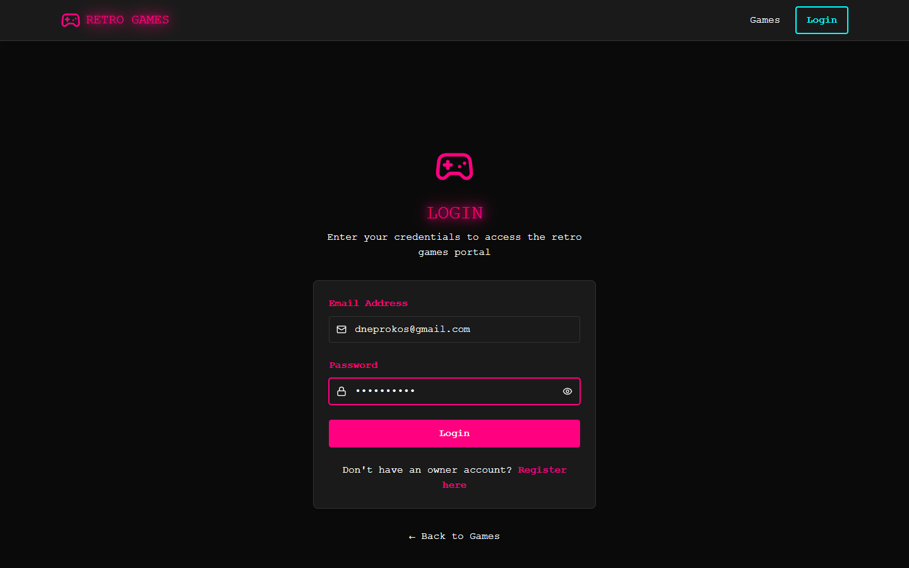
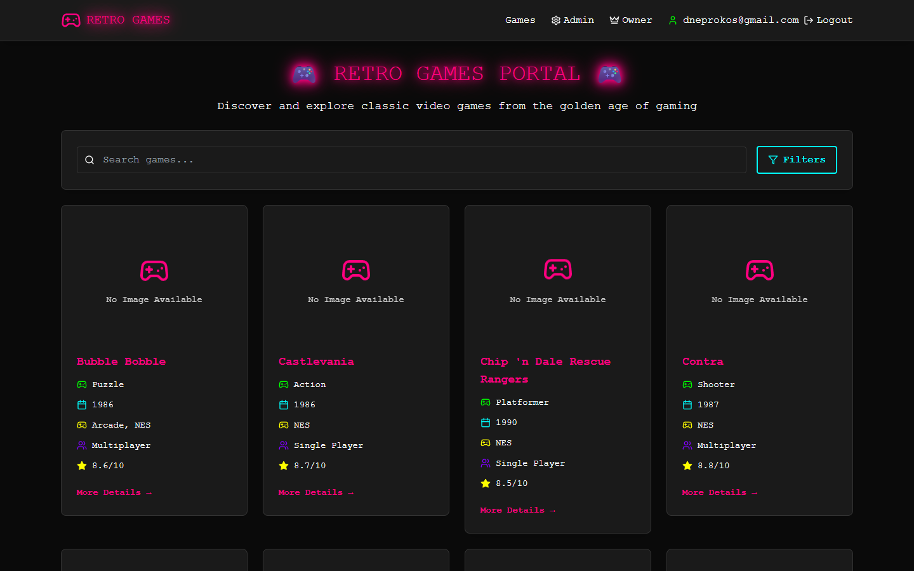
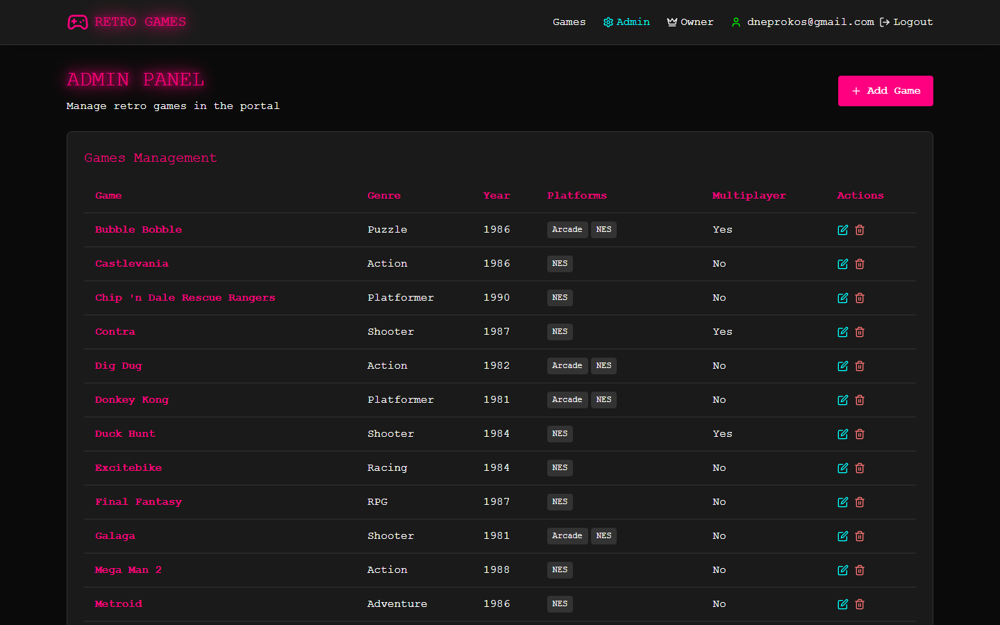
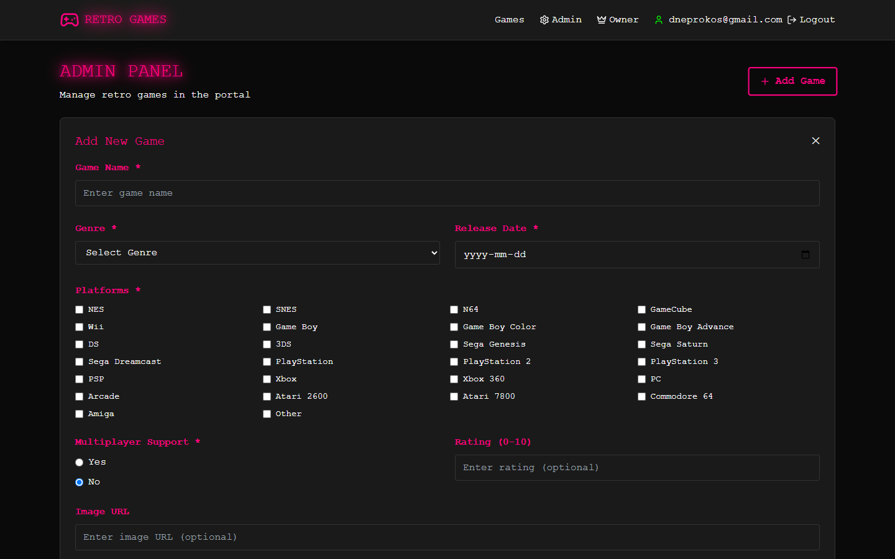
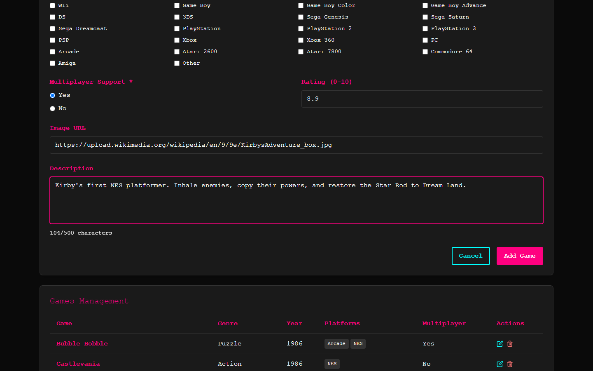
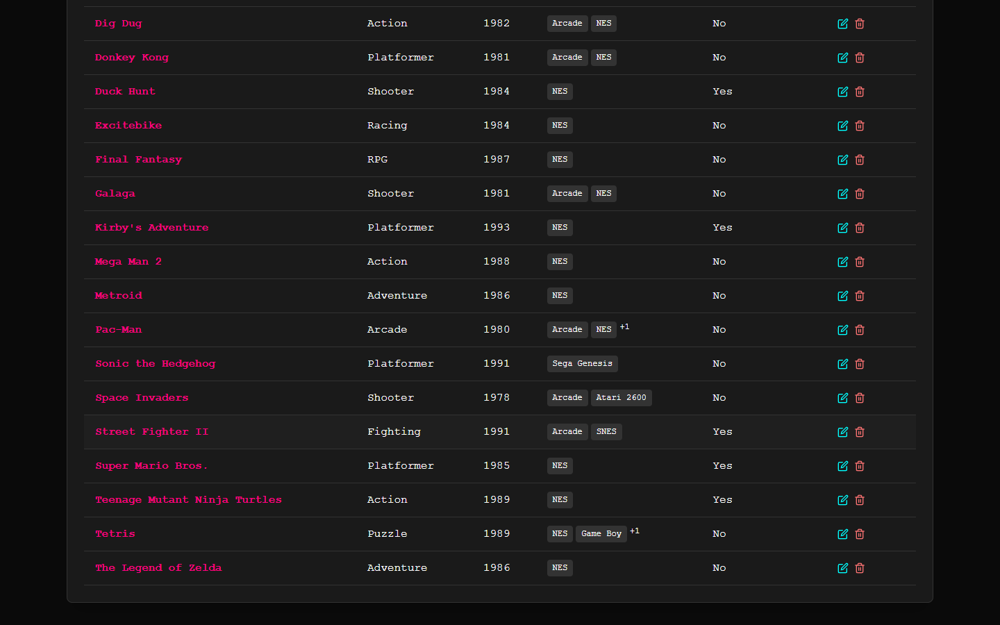
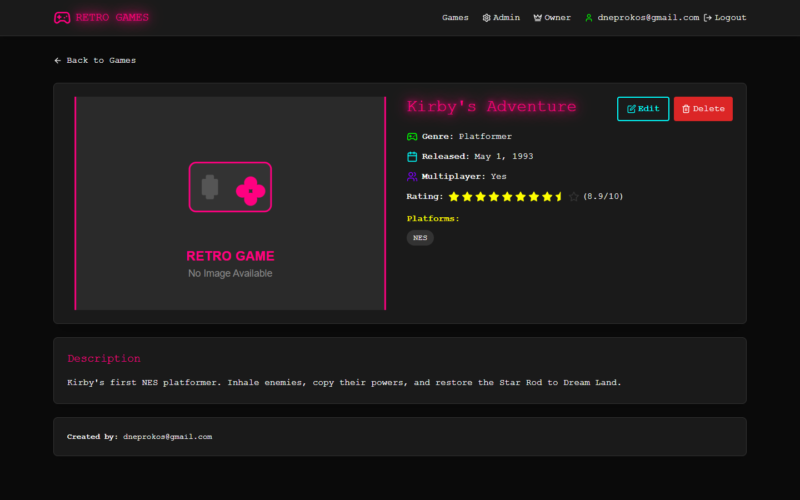

# How to Add a New Game

This guide walks you through adding a new retro game to the **Retro Games Portal**, from logging in as a privileged user to verifying the game appears in the catalog.

> **Who can do this?** Only users with the **Admin** or **Owner** role can add games. Guests can only browse. In this guide we use the **Owner** account (`**********`).

---

## Step 1 — Open the portal

Navigate to the portal home page. As an anonymous visitor you can browse the games catalog, search, and filter, but the top navigation only shows **Games** and **Login** — there is no way to add a game yet.

---

## Step 2 — Go to the Login page

Click **Login** in the top-right navigation. You are taken to the login form.

---

## Step 3 — Sign in with an Admin/Owner account

Enter the credentials of a user that has the **Admin** or **Owner** role:

| Field         | Value                 |
| ------------- | --------------------- |
| Email Address | `dneprokos@gmail.com` |
| Password      | `••••••••••`          |

Click **Login**. On success you are redirected back to the home page. Notice the navigation bar now shows **Admin** and **Owner** links plus your email and a **Logout** button — confirmation that you are signed in with elevated permissions.

---

## Step 4 — Open the Admin Panel

Click **Admin** in the navigation. The **Admin Panel** lists every game currently in the portal in a management table, with **Edit** / **Delete** actions per row and an **Add Game** button at the top.

---

## Step 5 — Open the "Add Game" form

Click the **Add Game** button. A form titled **Add New Game** opens. Fields marked with `*` are required.

### Field reference

| Field                   | Required | Notes                                                   |
| ----------------------- | -------- | ------------------------------------------------------- |
| **Game Name**           | ✅       | Must be unique, minimum 2 characters.                   |
| **Genre**               | ✅       | Pick one from the dropdown (Action, Adventure, RPG, …). |
| **Release Date**        | ✅       | Cannot be in the future.                                |
| **Platforms**           | ✅       | Tick at least one (NES, SNES, Arcade, …).               |
| **Multiplayer Support** | ✅       | Choose **Yes** or **No**.                               |
| **Rating (0–10)**       | optional | Numeric score.                                          |
| **Image URL**           | optional | Must be a valid URL.                                    |
| **Description**         | optional | Up to 500 characters.                                   |

---

## Step 6 — Fill in the game details

Complete the form. In this example we add **Kirby's Adventure**:

- **Game Name:** `Kirby's Adventure`
- **Genre:** `Platformer`
- **Release Date:** `1993-05-01`
- **Platforms:** `NES`
- **Multiplayer Support:** `Yes`
- **Rating:** `8.9`
- **Image URL:** cover art URL
- **Description:** a short summary

---

## Step 7 — Submit

Click the **Add Game** button at the bottom of the form. The form closes and the new game immediately appears in the management table.

> **If submission fails:** the most common cause is a duplicate **Game Name** (names must be unique) or a **Release Date** set in the future. Fix the highlighted field and submit again.

---

## Step 8 — Verify the game

Click the game's name in the table (or find it in the public catalog) to open its detail page and confirm the genre, platform, release year, rating, and description were saved correctly.

The game is now live in the catalog and visible to all visitors. 🎮

---

## Quick reference

1. Log in as **Admin** or **Owner**.
2. Open **Admin** → **Add Game**.
3. Fill required fields: Name, Genre, Release Date, Platform(s), Multiplayer.
4. (Optional) add Rating, Image URL, Description.
5. Click **Add Game** and verify it in the table / detail page.
