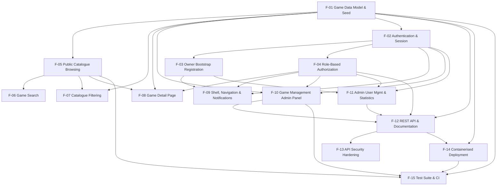

# Retro Video Games Portal — Feature Requirements

> **Status:** Derived from the implementation as of commit `d314ce6` (branch `main`). Every statement below is traceable to a file in this repository. Requirements are written forward-looking ("the system shall …") so this document can be handed to a delivery team and split into JIRA epics/stories without further archaeology.
>
> **Note on existing docs:** `README.MD`, `REQUIREMENTS.md`, `TEST_AUTOMATION_STRATEGY.md` and `TESTING_SUMMARY.md` were read for context but are stale in several places (see §8). Where docs and code disagree, **the code wins**.

---

## 1. Product Overview

The Retro Video Games Portal is a full-stack web application that hosts a browsable, searchable catalogue of classic video games. Anonymous visitors can explore the catalogue, search by name, filter by genre / release-year range / multiplayer support, and open a detail page for any title. Privileged users maintain the catalogue: **Admins** create, edit and delete games, while a single **Owner** additionally provisions and removes Admin accounts and views portal statistics. The product doubles as a deliberately realistic practice target for test automation — every interactive element carries stable `data-testid` hooks (`client/src/pages/Home.js:126`, `client/src/components/GameCard.js:26`) and the API is published as an OpenAPI document (`server/server.js:79`).

---

## 2. Tech Stack & Architecture

**Frontend**
- React 18.2 SPA created with Create React App / `react-scripts` 5.0.1 (`client/package.json:10-13`).
- Routing: `react-router-dom` 6.20 with `BrowserRouter` (`client/src/App.js:2`, routes at `client/src/App.js:22-41`).
- HTTP: `axios` 1.6 with a global `Authorization: Bearer <token>` default header (`client/src/contexts/AuthContext.js:22-27`).
- State: React Context (`AuthContext`) + component-local `useState`; no Redux/Zustand (`client/src/contexts/AuthContext.js:15`).
- Styling: Tailwind CSS 3.3 + PostCSS/Autoprefixer, custom `arcade-*` / `neon-*` design tokens (`client/tailwind.config.js`, `client/src/index.css`).
- Icons: `lucide-react`; Toasts: `react-hot-toast` `<Toaster position="top-right" duration=4000>` (`client/src/App.js:44-66`).
- Dev server proxies `/api` to `http://localhost:5000` (`client/package.json:55`).

**Backend**
- Node.js 18 + Express 4.18 (`server/package.json:24`, `docker/Dockerfile.server:2`).
- Entry point `server/server.js`; listens on `process.env.PORT || 5000` (`server/server.js:16`).
- Route modules mounted at `/api/auth`, `/api/games`, `/api/admin` (`server/server.js:44-46`).
- Health probe `GET /api/health` returning `{status:"OK"}` (`server/server.js:82-84`).
- Global error handler + catch-all 404 JSON handler (`server/server.js:87-98`).

**Storage**
- MongoDB (Mongoose 8.0 ODM). Two collections: `games`, `users` (`server/models/Game.js`, `server/models/User.js`).
- Connection is **non-blocking**: the HTTP server starts first and MongoDB connects afterwards; failure is logged, not fatal (`server/server.js:106-127`).
- Text index on `Game.name`; unique index on `Game.name` and `User.email` (`server/models/Game.js:123`, `docker/mongo-init.js` index block).
- Seed script `npm run seed` inserts ~14 classic titles when the collection is empty and clears all users (`server/seed.js`, seeding block at end of file).
- Container-first init script `docker/mongo-init.js` creates JSON-schema validators, indexes and 12 sample games.

**Authentication / Authorization**
- Stateless JWT (`jsonwebtoken` 9.0), signed with `JWT_SECRET`, default TTL `7d` (`server/routes/auth.js:10-16`).
- Passwords hashed with `bcryptjs` at cost factor 12 in a Mongoose `pre('save')` hook (`server/models/User.js:36-46`).
- Middleware: `authenticateToken`, `requireAdmin`, `requireOwner`, `optionalAuth` (`server/middleware/auth.js:80-85`).
- Token persisted client-side in `localStorage` under key `token` (`client/src/contexts/AuthContext.js:18,54`).

**Security middleware**
- `helmet()` default headers (`server/server.js:19`).
- `express-rate-limit`: 100 requests / 15 min / IP, disabled when `NODE_ENV==='test'` (`server/server.js:22-28`).
- CORS restricted to `CORS_ORIGIN` (default `http://localhost:3000`) with credentials (`server/server.js:31-34`).
- Request-body validation via `express-validator` on every mutating route (`server/routes/games.js:229-246`, `server/routes/admin.js:27-37`).
- JSON/urlencoded body limit 10 MB (`server/server.js:37-38`).

**API documentation**
- `swagger-jsdoc` + `swagger-ui-express` served at `/api-docs`, OpenAPI 3.0, bearer security scheme (`server/server.js:49-79`).

**Testing**
- Backend: Jest 29 + Supertest 6 + `mongodb-memory-server` 10; 80 % global coverage threshold configured (`server/jest.config.js:15-22`).
- Frontend: Jest via `react-scripts` + React Testing Library 13 + `@testing-library/user-event`; MSW 2.10 handlers scaffolded (`client/src/mocks/handlers.js`).
- E2E: Playwright 1.40, Chromium-only project enabled, Page Object Model, HTML + JSON + JUnit reporters (`e2e/playwright.config.js:18-22,43-48`).

**CI**
- GitHub Actions `Build and Test Retro Video Games Portal` on every PR and pushes to `main`/`develop` (`.github/workflows/build.yml:1-6`).
- Five parallel jobs + gated E2E job + summary job (`.github/workflows/build.yml:10,41,72,113,151,238`).
- Coverage uploaded to Codecov with `backend` / `frontend` flags (`.github/workflows/build.yml:33-38,64-69`).

**Containerization**
- `docker/docker-compose.yml`: three services — `mongodb` (mongo:7.0), `server` (node:18-alpine), `client` (multi-stage build → nginx:alpine) on a bridge network with health checks and named volumes.
- Nginx serves the SPA on container port 3000, reverse-proxies `/api/`, `/api/health` and `/api-docs` to `server:5000`, gzips text assets and sets 1-year immutable cache on static assets (`docker/nginx.conf:34-83`).
- Helper scripts `docker-run.ps1`, `docker-run.sh`, `docker-stop.ps1`.
- Secondary Azure App Service deployment path: `server/.deployment`, `server/startup.sh`, `server/deploy.ps1`, `server/create-deployment-package.ps1`.

**Key ports / entry points**

| Surface | Local dev | Docker Compose |
|---|---|---|
| React client | `http://localhost:3000` | `http://localhost:${CLIENT_PORT}` (default 9000) |
| Express API | `http://localhost:5000` | `http://localhost:${SERVER_PORT}` (default 5000) |
| Swagger UI | `http://localhost:5000/api-docs` | same, also proxied via client |
| Health | `GET /api/health` | same |
| MongoDB | `mongodb://localhost:27017/retro-games-portal` | `mongodb:27017` (internal) |

---

## 3. Actors / Roles

Roles are enumerated in `server/models/User.js:20` (`['guest','admin','owner']`) and resolved client-side in `client/src/contexts/AuthContext.js:99-115`.

| Role | Description | Capabilities summary |
|---|---|---|
| **Guest / Anonymous visitor** | Unauthenticated browser session. No `User` document is created for browsing; `guest` is the schema default for any user record that is neither admin nor owner. | Browse the catalogue, paginate, search by name, filter by genre / year range / multiplayer, open game detail pages, read Swagger docs, call all public `GET` endpoints. Cannot mutate anything. |
| **Admin** | A staff account created exclusively by the Owner (`server/routes/admin.js:57-63`). Authenticates with email + password. | All Guest capabilities, plus: access `/admin`, create games, edit games, delete games (from the Admin Panel table or a game detail page). Cannot see `/owner`, cannot list/create/delete users. `requireAdmin` also admits Owners (`server/middleware/auth.js:40`). |
| **Owner** | The single super-user. Bootstrapped by self-registration, allowed only for the address in `OWNER_EMAIL`, and only while no owner exists (`server/routes/auth.js:141-153`). | All Admin capabilities, plus: access `/owner`, list Admin accounts, create Admin accounts, delete Admin accounts, view portal statistics (total admins / total games). |

---

## 4. Feature Breakdown

### F-01: Game Catalogue Data Model & Seed Data

- **Summary:** Define the canonical Game record, its validation rules and controlled vocabularies, plus a repeatable way to populate a demo catalogue.
- **Actors:** All roles (indirectly); Admin/Owner directly through game forms; operators through the seed tooling.
- **Description:** Every other feature reads or writes a Game record, so the schema, its enums and its invariants are the foundation of the product. A Game carries identity (unique name), classification (genre, platforms), chronology (release date), a multiplayer flag, and optional presentation data (description, image URL, rating). Controlled vocabularies for genre and platform are published by the API so that the UI never hard-codes them. Provenance is captured through `createdBy` / `updatedBy` references and automatic `createdAt` / `updatedAt` timestamps. A seeding capability lets a fresh environment come up with a representative catalogue for demos, manual exploration and E2E runs.
- **Functional Requirements:**
  - **FR-01.1** The system shall persist a Game with the fields: `name`, `genre`, `platforms`, `releaseDate`, `hasMultiplayer`, `description`, `imageUrl`, `rating`, `createdBy`, `updatedBy`, `createdAt`, `updatedAt` (`server/models/Game.js:3-120`).
  - **FR-01.2** The system shall require `name`, reject names shorter than 2 characters after trimming, and guarantee that no two Games share a name (`server/models/Game.js:4-10,173-184`).
  - **FR-01.3** The system shall restrict `genre` to exactly one value from the fixed list: Action, Adventure, RPG, Strategy, Simulation, Sports, Racing, Puzzle, Platformer, Shooter, Fighting, Arcade, Educational, Other (`server/models/Game.js:11-30`).
  - **FR-01.4** The system shall require at least one `platform` and shall restrict each entry to the fixed 26-value platform list (NES … Amiga, Other) (`server/models/Game.js:31-71`).
  - **FR-01.5** The system shall require `releaseDate` and shall reject any date later than the current date with the message "Release date cannot be in the future" (`server/models/Game.js:72-81`).
  - **FR-01.6** The system shall require `hasMultiplayer` to be an explicit boolean (`server/models/Game.js:82-85`).
  - **FR-01.7** The system shall accept an optional `description` of at most 500 characters (`server/models/Game.js:86-90`).
  - **FR-01.8** The system shall accept an optional `imageUrl` and shall reject values that are neither an `http(s)` URL ending in `.jpg/.jpeg/.png/.gif/.webp` nor a Wikimedia/Wikipedia URL, with the message "Please enter a valid image URL" (`server/models/Game.js:91-102`).
  - **FR-01.9** The system shall accept an optional `rating` between 0 and 10 inclusive, defaulting to null (`server/models/Game.js:103-108`).
  - **FR-01.10** The system shall expose a derived release year and shall substitute `/images/default-game.svg` whenever a Game has no image URL (`server/models/Game.js:126-133`).
  - **FR-01.11** The system shall record the authenticated user who created a Game and the user who last updated it (`server/routes/games.js:288`, `server/routes/games.js:385`).
  - **FR-01.12** The system shall provide an idempotent seeding command that inserts the demo catalogue only when the Games collection is empty and reports a per-genre breakdown (`server/seed.js`, `server/package.json:18`).
  - **FR-01.13** The system shall maintain indexes on `Game.name` (unique + text), `genre`, `platforms`, `releaseDate` and `hasMultiplayer`, and on `User.email` (unique) (`server/models/Game.js:123`, `docker/mongo-init.js` index block).
- **Acceptance Criteria:**
  - Given a Game payload whose `name` is 1 character, When it is saved, Then persistence is rejected with "Game name must be at least 2 characters long".
  - Given an existing Game named "Contra", When a second Game named "Contra" is saved, Then persistence is rejected with "Game with this name already exists."
  - Given a Game with `releaseDate` set to tomorrow, When it is saved, Then persistence is rejected with "Release date cannot be in the future".
  - Given a Game with an empty `platforms` array, When it is saved, Then persistence is rejected with "At least one platform must be selected".
  - Given a Game with `rating: 11`, When it is saved, Then persistence is rejected with "Rating cannot be more than 10".
  - Given an empty Games collection, When the seed command runs, Then the demo catalogue is inserted and the total count is logged; When the command runs a second time, Then no duplicates are created.
  - Given any Game returned by the API, When its structure is inspected, Then `name`, `genre`, `platforms`, `releaseDate` and `hasMultiplayer` are all present (`e2e/tests/api.spec.js:18-27`, `e2e/tests/utils/api-client.js:88-100`).
- **Dependencies:** None.
- **Out of Scope:**
  - Per-platform release dates or regional variants.
  - Publisher, developer, ESRB rating, or franchise/series grouping.
  - Binary image storage — only a URL string is persisted.
  - Soft delete / revision history beyond `updatedBy` + `updatedAt`.

---

### F-02: Authentication & Session Management

- **Summary:** Let a registered Admin or Owner prove identity with email + password, receive a JWT, stay signed in across reloads, and sign out.
- **Actors:** Admin, Owner.
- **Description:** Catalogue mutation is restricted, so the product needs a credential exchange that yields a bearer token, plus a client-side session that survives page refreshes. On successful login the API issues a signed JWT and returns a sanitised user object; the client stores the token, attaches it to every subsequent request and re-hydrates the session on start-up by calling a "who am I" endpoint. Invalid or expired tokens must terminate the session cleanly rather than leave the UI in a half-authenticated state. Logout is client-driven token disposal, acknowledged by the API. Failure messages must never reveal whether the email or the password was wrong.
- **Functional Requirements:**
  - **FR-02.1** The system shall provide a login operation accepting `email` and `password` and shall reject syntactically invalid emails or an empty password with HTTP 400 and a field-level error list (`server/routes/auth.js:65-76`).
  - **FR-02.2** The system shall return HTTP 401 with the message "Invalid email or password" both when the email is unknown and when the password does not match (`server/routes/auth.js:81-90`).
  - **FR-02.3** On successful login the system shall return a JWT plus the user's `id`, `email`, `role` and `createdAt`, and shall never return the password hash (`server/routes/auth.js:99-108`, `server/middleware/auth.js:15`).
  - **FR-02.4** The system shall sign tokens with a server-side secret and shall expire them after `JWT_EXPIRES_IN` (default 7 days) (`server/routes/auth.js:10-16`).
  - **FR-02.5** The system shall record the timestamp of each successful login on the user record (`server/routes/auth.js:92-94`).
  - **FR-02.6** The system shall provide a "current user" operation that returns `id`, `email`, `role`, `createdAt` and `lastLogin` for a valid bearer token (`server/routes/auth.js:183-198`).
  - **FR-02.7** The system shall reject protected requests with HTTP 401 and the messages "Access token required", "Invalid token" or "Token expired" as appropriate (`server/middleware/auth.js:10-29`).
  - **FR-02.8** The client shall persist the token across browser reloads and shall attach it as an `Authorization: Bearer` header on every API call (`client/src/contexts/AuthContext.js:18-27,54`).
  - **FR-02.9** The client shall re-validate the stored token on application start-up and shall automatically clear the session if validation fails (`client/src/contexts/AuthContext.js:30-45`).
  - **FR-02.10** The system shall provide a logout operation that clears the client token, the axios default header and the in-memory user, and shall return the user to the home page (`client/src/contexts/AuthContext.js:87-93`, `client/src/components/Navbar.js:22-25`).
  - **FR-02.11** The login screen shall offer a password visibility toggle and shall disable the submit control while the request is in flight (`client/src/pages/Login.js:98-104,109-123`).
  - **FR-02.12** The system shall surface login success and failure as transient toast notifications (`client/src/contexts/AuthContext.js:56,60`).
- **Acceptance Criteria:**
  - Given valid Owner credentials, When the login form is submitted, Then a success toast appears, the navbar shows the user's email with Admin/Owner links, and the browser is redirected to `/`.
  - Given an unregistered email, When login is submitted, Then an error toast reading "Invalid email or password" appears and the user remains on `/login`.
  - Given a valid session, When the page is reloaded, Then the user remains signed in without re-entering credentials.
  - Given a token that has been tampered with in `localStorage`, When the application starts, Then the session is discarded and the navbar shows the Login control.
  - Given an authenticated user, When Logout is clicked, Then a "Logged out successfully" toast appears, the token is removed from storage, and the browser navigates to `/`.
  - Given no `Authorization` header, When `GET /api/auth/me` is called, Then the response is HTTP 401 "Access token required".
- **Dependencies:** F-01 (User/Game persistence layer shares the same Mongo connection).
- **Out of Scope:**
  - Refresh tokens, token rotation and server-side revocation/blacklisting.
  - Password reset, "forgot password" e-mail flows, and password change.
  - Multi-factor authentication, OAuth/SSO, and "remember me" duration choices.
  - Account lockout after repeated failures (only the global rate limiter applies — see F-13).

---

### F-03: Owner Bootstrap Registration

- **Summary:** Allow exactly one Owner account to be self-provisioned on a fresh installation, and hide the entry point once it exists.
- **Actors:** Prospective Owner (anonymous until registered).
- **Description:** A brand-new deployment has no users at all, so there must be a way to create the first privileged account without a pre-existing session. Registration is deliberately single-use and locked to a configured e-mail address: only the address in `OWNER_EMAIL` may register, and only while no owner exists. Once the Owner is created, the registration affordance disappears from the navigation so ordinary visitors are never invited to sign up. The newly created Owner is signed in immediately so setup can continue without a second credential entry.
- **Functional Requirements:**
  - **FR-03.1** The system shall provide a public registration operation accepting `email`, `password` and `confirmPassword` (`server/routes/auth.js:118-127`).
  - **FR-03.2** The system shall reject registration with HTTP 400 when the email is malformed, the password is shorter than 6 characters, or `confirmPassword` does not equal `password` (error text "Passwords must match") (`server/routes/auth.js:119-126`).
  - **FR-03.3** The system shall reject with HTTP 403 "Registration is only allowed for the owner account" any registration whose email differs from the configured `OWNER_EMAIL` (`server/routes/auth.js:138-145`).
  - **FR-03.4** The system shall reject with HTTP 400 "Owner account already exists" any registration attempted once an owner is present (`server/routes/auth.js:147-153`).
  - **FR-03.5** On success the system shall create the account with role `owner`, return HTTP 201, and issue a JWT so the user is immediately authenticated (`server/routes/auth.js:156-170`, `client/src/contexts/AuthContext.js:72-79`).
  - **FR-03.6** The system shall expose a public query that reports whether an Owner account already exists (`server/routes/auth.js:210-218`).
  - **FR-03.7** The navigation shall display a "Register Owner" control only while no Owner exists, and shall default to hiding it if the check fails (`client/src/components/Navbar.js:13-20,88-95,178-186`).
  - **FR-03.8** The registration form shall validate in real time — inline "Password must be at least 6 characters" and "Passwords must match" messages — and shall keep the submit control disabled until email, password and confirmation are all present and matching (`client/src/pages/Register.js:47-48,117-119,150-152,158`).
- **Acceptance Criteria:**
  - Given a database with no users, When the home page loads, Then the navigation shows both "Login" and "Register Owner".
  - Given the registration form and an email different from `OWNER_EMAIL`, When it is submitted, Then an error toast "Registration is only allowed for the owner account" appears and no account is created.
  - Given `password` "secret1" and `confirmPassword` "secret2", When the fields lose focus, Then "Passwords must match" is shown and the submit control stays disabled.
  - Given the configured owner email, a 6+ character password and a matching confirmation, When the form is submitted, Then the account is created, a success toast appears and the browser navigates to `/` in an authenticated Owner session.
  - Given an Owner already exists, When the home page loads, Then "Register Owner" is absent from the navigation.
  - Given an Owner already exists, When registration is posted again for the same email, Then the response is HTTP 400 "Owner account already exists".
- **Dependencies:** F-02.
- **Out of Scope:**
  - Self-service registration for Guests or Admins (Admins are created only by the Owner — see F-11).
  - E-mail verification of the Owner address.
  - Transferring ownership or creating a second Owner.

---

### F-04: Role-Based Authorization & Route Protection

- **Summary:** Enforce, on both the API and the SPA, that only Admins may mutate the catalogue and only the Owner may manage users.
- **Actors:** Guest, Admin, Owner.
- **Description:** The product exposes three privilege tiers, and every privileged surface must be closed on the server as well as hidden in the UI. Server-side guards run before route handlers and distinguish "not authenticated" (401) from "authenticated but insufficient" (403). Client-side, a route wrapper decides between a loading state, a redirect to login, an explicit "Access Denied" panel, and rendering the page. Owner privileges are a strict superset of Admin privileges, so an Owner passes every Admin check. Navigation links are role-aware so users are not shown destinations they cannot reach.
- **Functional Requirements:**
  - **FR-04.1** The system shall reject unauthenticated requests to protected endpoints with HTTP 401 (`server/middleware/auth.js:36-38,49-51`).
  - **FR-04.2** The system shall reject authenticated non-Admin requests to Admin endpoints with HTTP 403 "Admin access required" (`server/middleware/auth.js:40-43`).
  - **FR-04.3** The system shall reject authenticated non-Owner requests to Owner endpoints with HTTP 403 "Owner access required" (`server/middleware/auth.js:53-56`).
  - **FR-04.4** The system shall treat the Owner role as satisfying every Admin-level authorization check (`server/models/User.js:59-61`, `client/src/contexts/AuthContext.js:110-112`).
  - **FR-04.5** The SPA shall render a loading indicator while the session is being resolved and shall not prematurely redirect (`client/src/components/ProtectedRoute.js:9-18`).
  - **FR-04.6** The SPA shall redirect unauthenticated users away from `/admin` and `/owner` to `/login`, replacing the history entry (`client/src/components/ProtectedRoute.js:20-22`).
  - **FR-04.7** The SPA shall render an "Access Denied" panel naming the required role when an authenticated user lacks the necessary privilege (`client/src/components/ProtectedRoute.js:24-38`).
  - **FR-04.8** The navigation shall show the Admin link only to Admins and Owners, and the Owner link only to Owners (`client/src/components/Navbar.js:48-66`).
  - **FR-04.9** The game detail page shall show Edit and Delete controls only to Admins and Owners (`client/src/pages/GameDetails.js:155-177`).
- **Acceptance Criteria:**
  - Given an anonymous visitor, When `/admin` is opened directly, Then the browser is redirected to `/login`.
  - Given an authenticated Admin, When `/owner` is opened directly, Then an "Access Denied" panel is shown stating "Required role: owner".
  - Given an authenticated Owner, When `/admin` is opened, Then the Admin Panel renders normally.
  - Given a valid Admin token, When `GET /api/admin/users` is called, Then the response is HTTP 403 "Owner access required".
  - Given no token, When `POST /api/games` is called, Then the response is HTTP 401 and no Game is created.
  - Given an anonymous visitor on a game detail page, When the page renders, Then no Edit or Delete control is present.
  - Given a malformed `Authorization` header (missing the "Bearer" scheme or an empty token), When a protected endpoint is called, Then the response is HTTP 401 (`server/middleware/auth.test.js:130-146`).
- **Dependencies:** F-02.
- **Out of Scope:**
  - Fine-grained per-resource permissions (e.g. "Admin may edit only games they created").
  - Custom roles or permission groups beyond guest/admin/owner.
  - Audit logging of denied access attempts.

---

### F-05: Public Game Catalogue Browsing

- **Summary:** Present the catalogue as a paginated, responsive grid of game cards that anyone can browse without signing in.
- **Actors:** Guest, Admin, Owner.
- **Description:** The home page is the product's front door and must be fully usable anonymously. Games are fetched from a public endpoint, sorted alphabetically, and rendered 12 per page as cards summarising the essentials: cover art (or a clearly-marked placeholder), name, genre, release year, an abbreviated platform list, multiplayer status and rating. Pagination controls appear only when more than one page exists and disable themselves at the boundaries. A running "showing X of Y" counter keeps the user oriented, and an explicit empty state explains what to do when nothing matches. Broken image URLs must degrade to the placeholder rather than showing a browser's broken-image icon.
- **Functional Requirements:**
  - **FR-05.1** The system shall expose the catalogue over a public endpoint requiring no authentication (`server/routes/games.js:44-66`).
  - **FR-05.2** The system shall return games sorted alphabetically ascending by name by default (`server/routes/games.js:120`).
  - **FR-05.3** The system shall paginate results with a default page size of 12 and shall return `currentPage`, `totalPages`, `totalGames`, `hasNextPage` and `hasPrevPage` alongside the data (`server/routes/games.js:82-84,128-137`, `client/src/pages/Home.js:33`).
  - **FR-05.4** The system shall accept `page` ≥ 1 and `limit` between 1 and 1000 and shall reject out-of-range values with HTTP 400 (`server/routes/games.js:64-65`).
  - **FR-05.5** Each catalogue card shall display the game name, genre, four-digit release year, platform summary, multiplayer status ("Multiplayer" / "Single Player") and, when present, the rating as `N/10` (`client/src/components/GameCard.js:50-115`).
  - **FR-05.6** Each card shall abbreviate more than two platforms as "A, B +N more" and shall display "No platforms" when the list is empty (`client/src/components/GameCard.js:10-18`).
  - **FR-05.7** Each card shall render the game image when available and shall fall back to a "No Image Available" placeholder both when no URL is stored and when the image fails to load (`client/src/components/GameCard.js:6-43`).
  - **FR-05.8** The catalogue shall arrange cards responsively at 1 / 2 / 3 / 4 columns for small / medium / large / extra-large viewports (`client/src/pages/Home.js:155`).
  - **FR-05.9** The catalogue shall render Previous and Next controls only when more than one page exists, and shall disable each control at its respective boundary (`client/src/pages/Home.js:162-183`).
  - **FR-05.10** The catalogue shall display the current page position as "Page X of Y" and a result summary as "Showing N of T games" (`client/src/pages/Home.js:172-174,187-189`).
  - **FR-05.11** The catalogue shall display a "No Games Found" empty state with guidance when the result set is empty (`client/src/pages/Home.js:191-199`).
  - **FR-05.12** The catalogue shall display a loading indicator during the initial fetch and shall raise an error toast if the fetch fails (`client/src/pages/Home.js:88-97,42-43`).
  - **FR-05.13** Selecting a card shall navigate to that game's detail route (`client/src/components/GameCard.js:25`).
- **Acceptance Criteria:**
  - Given a seeded catalogue, When the home page loads, Then the document title is "Retro Games Portal", the filter panel is collapsed, and at least one game card is visible (`e2e/tests/home-page.spec.js:13-38`, `e2e/tests/navigation.spec.js:11-20`).
  - Given a seeded catalogue, When the home page and `GET /api/games` are compared, Then the set of names rendered in the UI exactly matches the API response (`e2e/tests/home-page.spec.js:29-34`).
  - Given the rendered cards, When each image container is inspected, Then it contains either an image with an `http` source or the "No Image Available" placeholder (`e2e/tests/home-page.spec.js:40-60`).
  - Given the rendered cards, When ratings are read, Then every rating is between 0 and 10 inclusive (`e2e/tests/home-page.spec.js:62-76`).
  - Given a catalogue with 13 or more games, When the home page loads, Then 12 cards are shown, "Page 1 of 2" is displayed and Previous is disabled.
  - Given a game card, When it is clicked, Then the browser navigates to `/game/<id>` and the detail page renders.
- **Dependencies:** F-01.
- **Out of Scope:**
  - Infinite scroll, user-selectable sort order, or user-selectable page size in the UI.
  - Client-side caching of pages already fetched.
  - Favourites, wishlists, or "recently viewed".

---

### F-06: Game Search by Name

- **Summary:** Let any visitor narrow the catalogue by typing part of a game's name, with results updating as they type.
- **Actors:** Guest, Admin, Owner.
- **Description:** Name search is the fastest path to a specific title and is available on the home page without authentication. The match is a case-insensitive substring, so "mario" finds "Super Mario Bros." Searching resets the pagination to page 1 so users are never stranded on an out-of-range page. Because the results grid re-renders on every keystroke, the search field must retain keyboard focus and caret position throughout — including when the result set collapses to the empty state, which was a previously-reported defect. Clearing the field restores the unfiltered catalogue.
- **Functional Requirements:**
  - **FR-06.1** The system shall filter games by a case-insensitive substring match against the game name (`server/routes/games.js:89-92`).
  - **FR-06.2** The system shall treat an empty or omitted search term as "no name filter" and shall return the full catalogue (`server/routes/games.js:90`).
  - **FR-06.3** The system shall treat the search term as literal text and shall not execute it as a database command (`e2e/tests/fixtures/test-data.js:16-19`).
  - **FR-06.4** The search field shall re-query the catalogue on every input change without requiring an explicit submit action (`client/src/pages/Home.js:63-66,122`).
  - **FR-06.5** Changing the search term shall reset the result set to page 1 (`client/src/pages/Home.js:65`).
  - **FR-06.6** The search field shall retain keyboard focus and restore the caret to the end of the value after the results re-render, including when the empty state is displayed (`client/src/pages/Home.js:69-86`).
  - **FR-06.7** Search shall combine with any active filters using AND semantics (`server/routes/games.js:86-113`).
  - **FR-06.8** Clearing filters shall preserve the current search term (`client/src/components/FilterPanel.js:39-49`).
- **Acceptance Criteria:**
  - Given a catalogue containing "Super Mario Bros.", When "mario" is typed into the search field, Then only matching games are displayed and the UI result set equals `GET /api/games?search=mario` (`e2e/tests/search.spec.js:13-49`).
  - Given any catalogue, When "NonExistentGame12345" is searched, Then zero cards are rendered and the "No Games Found" state is shown (`e2e/tests/search.spec.js:51-83`).
  - Given a non-empty search, When the field is cleared, Then the full catalogue count is restored (`e2e/tests/search.spec.js:93-96`).
  - Given the search field, When "!@#$%^&*()" is entered, Then zero results are returned and no error is raised (`e2e/tests/search.spec.js:98-101`).
  - Given the search field, When a 100-character term is entered, Then zero results are returned and the page remains responsive (`e2e/tests/search.spec.js:103-107`).
  - Given several search terms typed in quick succession, When the last term is cleared, Then the full catalogue is displayed and no stale results remain (`e2e/tests/edge-cases.spec.js:38-63`).
  - Given the search field has focus and the term matches nothing, When the empty state renders, Then the search field still has focus and the caret is at the end of the text.
- **Dependencies:** F-05.
- **Out of Scope:**
  - Fuzzy matching, typo tolerance, synonyms, or relevance ranking.
  - Search over description, genre or platform text.
  - Search suggestions / autocomplete and search history.
  - Explicit request debouncing (each keystroke currently issues a request).

---

### F-07: Catalogue Filtering

- **Summary:** Let any visitor narrow the catalogue by genre, release-year range and multiplayer support through a collapsible filter panel.
- **Actors:** Guest, Admin, Owner.
- **Description:** Beyond name search, visitors need to slice the catalogue by its structured attributes. A filter panel — hidden by default to keep the grid prominent — offers a genre dropdown populated from the server's controlled vocabulary, From/To year dropdowns bounded by the actual data, and a multiplayer selector. Filter edits are staged locally and only take effect when Apply is pressed, so users can compose a multi-criterion query in one round trip. A Clear action resets every filter at once while preserving the active search term. Year bounds are derived from the catalogue itself so the dropdowns never offer empty ranges.
- **Functional Requirements:**
  - **FR-07.1** The system shall expose a public endpoint returning the available genres, the full platform list, and the minimum/maximum release years present in the catalogue (`server/routes/games.js:453-486`).
  - **FR-07.2** The system shall default the reported year range to 1970–current year when the catalogue is empty (`server/routes/games.js:472-475`).
  - **FR-07.3** The system shall filter games by exact genre match (`server/routes/games.js:94-97`).
  - **FR-07.4** The system shall filter games by release-year range, inclusive of both bounds, accepting either bound independently (`server/routes/games.js:99-108`).
  - **FR-07.5** The system shall reject year parameters outside 1970 … current year with HTTP 400 "Year must be between 1970 and current year" (`server/routes/games.js:50-59`).
  - **FR-07.6** The system shall filter games by multiplayer support and shall reject values other than `true`/`false`/empty with HTTP 400 (`server/routes/games.js:60-63,110-113`).
  - **FR-07.7** The system shall combine search, genre, year range and multiplayer filters using AND semantics (`server/routes/games.js:86-113`).
  - **FR-07.8** The filter panel shall be collapsed on first load and shall toggle open and closed from a single control (`client/src/pages/Home.js:131-149`).
  - **FR-07.9** The filter panel shall stage edits locally and shall apply them to the result set only when Apply Filters is activated (`client/src/components/FilterPanel.js:30-37,140-146`).
  - **FR-07.10** The Clear Filters action shall reset genre, year range and multiplayer to "any", shall preserve the current search term, and shall immediately re-query (`client/src/components/FilterPanel.js:39-49`).
  - **FR-07.11** Applying or clearing filters shall reset the result set to page 1 (`client/src/pages/Home.js:54-57`).
  - **FR-07.12** The year dropdowns shall list years in descending order between the reported minimum and maximum (`client/src/components/FilterPanel.js:51-57`).
  - **FR-07.13** The multiplayer selector shall offer exactly "All Games", "Multiplayer Only" and "Single Player Only" (`client/src/components/FilterPanel.js:120-124`).
- **Acceptance Criteria:**
  - Given the home page, When it first loads, Then the filter panel is not visible (`e2e/tests/home-page.spec.js:19`, `e2e/tests/navigation.spec.js:18`).
  - Given the filter panel is open, When genre "Action" is selected and Apply Filters is pressed, Then the displayed games match `GET /api/games?genre=Action` exactly and the count is not greater than the unfiltered count (`e2e/tests/filters.spec.js:13-47`).
  - Given an applied genre filter, When Clear Filters is pressed, Then the original unfiltered game count is restored (`e2e/tests/filters.spec.js:99-131`, `e2e/tests/navigation.spec.js:22-37`).
  - Given the filter panel, When genre filters are switched rapidly and then cleared, Then the final displayed count equals the original unfiltered count (`e2e/tests/edge-cases.spec.js:11-36`).
  - Given an applied genre filter, When a search term is also entered, Then the result set satisfies both criteria and no error is raised (`e2e/tests/edge-cases.spec.js:65-87`).
  - Given `yearFrom=1969`, When the catalogue is requested, Then the response is HTTP 400 with "Year must be between 1970 and current year".
  - Given `multiplayer=maybe`, When the catalogue is requested, Then the response is HTTP 400 with "Multiplayer must be true or false".
- **Dependencies:** F-01, F-05.
- **Out of Scope:**
  - Filtering by platform (the platform list is published but no platform filter exists on the API or in the UI — see §8).
  - Filtering by rating range, or by created/updated date.
  - Persisting filter state in the URL query string or in browser storage.
  - Showing per-option result counts (facet counts).

---

### F-08: Game Detail Page

- **Summary:** Show the complete record for a single game on its own addressable page, with inline Edit/Delete affordances for privileged users.
- **Actors:** Guest, Admin, Owner.
- **Description:** Cards deliberately show a summary, so a dedicated page is needed for the full picture: large cover art, full-length description, the complete platform list, genre, formatted release date, multiplayer status and a 10-star rating visualisation. The page is directly addressable by game id so it can be linked and bookmarked. Provenance ("created by", "last updated by") is surfaced for transparency. Admins and Owners see Edit and Delete controls in place, so maintenance can start from wherever the problem was noticed. Unknown or malformed ids must resolve to a friendly not-found page, never a crash or a silent redirect.
- **Functional Requirements:**
  - **FR-08.1** The system shall expose a public endpoint returning a single game by id, resolving the creator and last-updater e-mail addresses (`server/routes/games.js:163-184`).
  - **FR-08.2** The system shall return HTTP 404 "Game not found" both for a well-formed id that does not exist and for a malformed id (`server/routes/games.js:172-182`).
  - **FR-08.3** The detail page shall display the game name, genre, release date in long form (e.g. "September 13, 1985"), multiplayer status, the complete platform list, and the description when present (`client/src/pages/GameDetails.js:152-237`).
  - **FR-08.4** The detail page shall render the rating as a 10-star scale with half-star precision plus the numeric value, and shall omit the rating block when no rating exists (`client/src/pages/GameDetails.js:77-96,202-210`).
  - **FR-08.5** The detail page shall display the stored cover image and shall fall back to `/images/default-game.svg` when no URL exists or the image fails to load (`client/src/pages/GameDetails.js:62-67,138-146`).
  - **FR-08.6** The detail page shall display "Created by" and, when applicable, "Last updated by" (`client/src/pages/GameDetails.js:240-251`).
  - **FR-08.7** The detail page shall provide a "Back to Games" link returning to the catalogue (`client/src/pages/GameDetails.js:122-131`).
  - **FR-08.8** The detail page shall display a loading indicator while fetching and a "Game Not Found" panel with a return link when the game cannot be retrieved (`client/src/pages/GameDetails.js:98-117`).
  - **FR-08.9** For Admins and Owners the detail page shall provide an Edit control that opens the game's edit form, and a Delete control (`client/src/pages/GameDetails.js:155-177`).
  - **FR-08.10** Deleting from the detail page shall require explicit confirmation, shall show a success toast, and shall return the user to the catalogue (`client/src/pages/GameDetails.js:44-60`).
- **Acceptance Criteria:**
  - Given a valid game id, When `/game/<id>` is opened, Then the displayed name, genre, platforms, rating, description, release year and multiplayer status all match `GET /api/games/<id>` (`e2e/tests/game-card.spec.js:13-95`).
  - Given a game with an image URL, When the detail page renders, Then the image element's source equals the stored URL (`e2e/tests/game-card.spec.js:74-80`).
  - Given the id "invalid-game-id-12345", When `/game/invalid-game-id-12345` is opened, Then a visible error panel containing "Game Not Found" is rendered (`e2e/tests/game-card.spec.js:97-111`).
  - Given a game detail page, When "Back to Games" is activated, Then the browser navigates to the catalogue root (`e2e/tests/game-card.spec.js:113-135`).
  - Given a signed-in Admin on a detail page, When Delete is activated and confirmed, Then a success toast appears and the browser returns to the catalogue with the game absent.
  - Given a game with no rating, When the detail page renders, Then no star row is displayed.
- **Dependencies:** F-01, F-05; F-04 for the privileged controls.
- **Out of Scope:**
  - Per-game document titles / meta tags (the title is static — see `e2e/tests/game-card.spec.js:33-34`).
  - User reviews, comments, or community ratings.
  - Related-game or recommendation modules.
  - Social sharing controls.

---

### F-09: Application Shell, Navigation & Notifications

- **Summary:** Provide the persistent retro-themed frame — branding, role-aware navigation, responsive mobile menu and global toast notifications — that wraps every page.
- **Actors:** Guest, Admin, Owner.
- **Description:** Every route shares a chrome that must communicate who is signed in, what they may do, and the outcome of their last action. A top navigation bar carries the brand mark, a link back to the catalogue, role-conditional links to the Admin and Owner panels, the signed-in e-mail address and a Logout control — or Login and (when applicable) Register Owner for anonymous visitors. Below a medium viewport the links collapse into a hamburger menu that closes on selection. A single global toast region reports successes and failures consistently, so individual pages never invent their own notification patterns. The whole shell follows a dark arcade aesthetic with neon accents.
- **Functional Requirements:**
  - **FR-09.1** The system shall render a persistent navigation bar on every route, containing brand identity that links to the catalogue (`client/src/App.js:19`, `client/src/components/Navbar.js:32-35`).
  - **FR-09.2** The navigation shall show Login for anonymous visitors and the signed-in e-mail plus Logout for authenticated users (`client/src/components/Navbar.js:46-97`).
  - **FR-09.3** The navigation shall collapse into a toggleable menu below the medium breakpoint, and selecting any item shall close it (`client/src/components/Navbar.js:100-191`).
  - **FR-09.4** The system shall provide a single global notification region rendering transient toasts in the top-right for 4 seconds, styled distinctly for success and error (`client/src/App.js:44-66`).
  - **FR-09.5** The system shall define the routes `/`, `/game/:id`, `/login`, `/register`, `/admin` and `/owner`, with `/admin` and `/owner` wrapped in role guards (`client/src/App.js:22-41`).
  - **FR-09.6** The application shell shall apply the arcade dark theme with neon accents and shall present a minimum full-viewport-height layout (`client/src/App.js:18-20`, `client/src/index.css`).
  - **FR-09.7** All navigation shall be client-side, without full page reloads (`client/src/App.js:2,17`).
  - **FR-09.8** When served as a static bundle, any unknown path shall be delivered the SPA entry document so client-side routing resolves it (`docker/nginx.conf:74-76`).
- **Acceptance Criteria:**
  - Given any route, When the page renders, Then the navigation bar with the brand mark and a "Games" link is present.
  - Given an anonymous visitor and an existing Owner account, When the navigation renders, Then it shows Login and shows neither Register Owner, Admin nor Owner.
  - Given a signed-in Admin, When the navigation renders, Then it shows Admin, the user's e-mail and Logout, but not Owner.
  - Given a signed-in Owner, When the navigation renders, Then it shows both Admin and Owner.
  - Given a viewport narrower than the medium breakpoint, When the hamburger control is activated, Then the vertical menu opens; When any item in it is selected, Then the menu closes and navigation occurs.
  - Given any action that succeeds or fails, When it completes, Then exactly one toast appears in the top-right and disappears automatically.
- **Dependencies:** F-02, F-03, F-04.
- **Out of Scope:**
  - Light/dark theme switching or user-selectable themes.
  - Internationalisation and localisation.
  - Breadcrumbs, a footer, or a site-wide search in the header.
  - A dedicated 404 route for unmatched client paths (unmatched paths currently render the shell with an empty main region).

---

### F-10: Game Management (Admin Panel)

- **Summary:** Give Admins and Owners a single console to list, create, edit and delete games with full field validation.
- **Actors:** Admin, Owner.
- **Description:** The Admin Panel is the catalogue's editorial surface. It loads the complete game list into a management table showing name, genre, year, platforms and multiplayer status, with per-row Edit and Delete actions and an Add Game control at the top. Add and Edit share one form whose controls mirror the data model exactly: text input for the name, dropdown for genre, checkbox group for platforms, date picker capped at today, radio pair for multiplayer, a numeric rating field, a URL field and a character-counted description textarea. Validation runs client-side for immediate feedback and again server-side as the authority. Deletion always requires confirmation. The panel can be deep-linked into edit mode for a specific game so the Edit control on a detail page lands directly on the right form.
- **Functional Requirements:**
  - **FR-10.1** The system shall present Admins and Owners with a table of all games showing name, genre, release year, an abbreviated platform list and multiplayer status (`client/src/pages/AdminPanel.js:196-286`).
  - **FR-10.2** The management table shall load the catalogue without the public page size limit so every game is manageable in one view (`client/src/pages/AdminPanel.js:56`).
  - **FR-10.3** The management table shall link each game name to its public detail page (`client/src/pages/AdminPanel.js:227-232`).
  - **FR-10.4** The system shall provide a create-game operation restricted to Admins and Owners that returns HTTP 201 and the created record (`server/routes/games.js:226-296`).
  - **FR-10.5** The system shall provide an update-game operation restricted to Admins and Owners that accepts partial payloads and returns the updated record (`server/routes/games.js:335-393`).
  - **FR-10.6** The system shall provide a delete-game operation restricted to Admins and Owners that returns HTTP 200 on success and HTTP 404 when the game does not exist (`server/routes/games.js:424-441`).
  - **FR-10.7** The system shall reject creation or update of a game whose release date is in the future with HTTP 400 "Release date cannot be in the future." (`server/routes/games.js:267-270,377-380`).
  - **FR-10.8** The system shall reject creation of a game whose name already exists with HTTP 400 "Game with this name already exists." (`server/routes/games.js:272-276`).
  - **FR-10.9** The system shall validate on submission that the name is at least 2 characters, the genre is a known value, at least one known platform is selected, the release date is a valid ISO date, multiplayer is boolean, the description is at most 500 characters, the image URL is well formed and the rating is between 0 and 10 (`server/routes/games.js:232-245`).
  - **FR-10.10** The game form shall validate the same rules client-side and shall present field-level error messages that clear as the user corrects the field (`client/src/components/GameForm.js:85-127,62-65`).
  - **FR-10.11** The game form shall populate genre and platform choices from the server-published vocabularies rather than a hard-coded list (`client/src/components/GameForm.js:42-53`).
  - **FR-10.12** The date control shall prevent selection of dates later than today (`client/src/components/GameForm.js:216`).
  - **FR-10.13** The description control shall enforce a 500-character maximum and shall display a live character counter (`client/src/components/GameForm.js:325,329-331`).
  - **FR-10.14** The form shall pre-populate every field when editing and shall label its submit control "Update Game" rather than "Add Game" (`client/src/components/GameForm.js:25-37,355`).
  - **FR-10.15** Deleting a game shall require an explicit confirmation warning that the action cannot be undone (`client/src/pages/AdminPanel.js:92-99`).
  - **FR-10.16** Every create, update and delete shall report its outcome as a toast and shall refresh the management table on success (`client/src/pages/AdminPanel.js:66-109`).
  - **FR-10.17** The Admin Panel shall support being opened directly in edit mode for a nominated game, fetching that game if it is not already loaded, and shall clear the deep-link parameter afterwards so the form does not reopen (`client/src/pages/AdminPanel.js:20-50`).
  - **FR-10.18** The Admin Panel shall display an empty state inviting the first game to be added when the catalogue is empty (`client/src/pages/AdminPanel.js:188-194`).
  - **FR-10.19** The form shall disable its submit control and show a "Saving…" state while a submission is in flight (`client/src/components/GameForm.js:344-357`).
- **Acceptance Criteria:**
  - Given a signed-in Admin, When `/admin` is opened, Then the games management table lists every game with Edit and Delete actions and an Add Game control is present (`docs/guides/add-new-game.md` Step 4).
  - Given the Add New Game form with all required fields completed and a valid past release date, When it is submitted, Then the form closes, a "Game added successfully" toast appears and the new game appears in the table (`docs/guides/add-new-game.md` Step 7).
  - Given the Add New Game form with the name of an existing game, When it is submitted, Then an error toast reading "Game with this name already exists." appears and no game is created.
  - Given the Add New Game form with a release date in the future, When submission is attempted, Then the release-date field shows "Release date cannot be in the future" and no request is sent.
  - Given the Add New Game form with no platform ticked, When submission is attempted, Then "At least one platform must be selected" is displayed.
  - Given a game detail page viewed as an Admin, When Edit is activated, Then the Admin Panel opens with the edit form pre-populated for that game.
  - Given a row in the management table, When Delete is activated and the confirmation is dismissed, Then the game remains; When the confirmation is accepted, Then a success toast appears and the row disappears.
  - Given a valid Admin token, When `PUT /api/games/<unknown-id>` is called, Then the response is HTTP 404 "Game not found" (`server/routes/games.test.js:310-318`).
- **Dependencies:** F-01, F-02, F-04.
- **Out of Scope:**
  - Uploading image files (only a URL string is accepted — the drag-and-drop uploader described in the legacy `REQUIREMENTS.md:141` does not exist).
  - Bulk import/export, CSV upload, or multi-select bulk delete.
  - Draft/unpublished states, scheduled publication, or approval workflow.
  - Sorting, searching or paginating within the management table.
  - Undo / restore of a deleted game.

---

### F-11: Admin User Management & Portal Statistics (Owner Panel)

- **Summary:** Give the Owner a console to provision and revoke Admin accounts and to see at-a-glance portal totals.
- **Actors:** Owner.
- **Description:** Because Admins cannot self-register, the Owner needs a dedicated screen to create them. The Owner Panel lists existing Admins with their e-mail, role badge, creation date and last-login date, each with a delete action. An Add Admin form collects e-mail, password and confirmation with the same strength rules as owner registration, and states plainly what an Admin may and may not do. Two summary tiles show the total number of Admins and the total number of Games, giving the Owner a quick sense of the portal's scale. Deletion is guarded by confirmation and by a server-side rule that only accounts with the Admin role may be removed — the Owner cannot delete themselves.
- **Functional Requirements:**
  - **FR-11.1** The system shall provide an Owner-only operation listing all Admin accounts, most recently created first, excluding password data (`server/routes/admin.js:11-22`).
  - **FR-11.2** The system shall provide an Owner-only operation creating an Admin account from `email`, `password` and `confirmPassword`, returning HTTP 201 (`server/routes/admin.js:24-73`).
  - **FR-11.3** The system shall reject Admin creation with HTTP 400 when the e-mail is malformed, the password is shorter than 6 characters, or the confirmation does not match ("Passwords must match") (`server/routes/admin.js:30-37`).
  - **FR-11.4** The system shall reject Admin creation with HTTP 400 "User with this email already exists" when the address is already registered in any role (`server/routes/admin.js:50-54,75-78`).
  - **FR-11.5** The system shall provide an Owner-only operation deleting an Admin account, returning HTTP 404 when the account does not exist (`server/routes/admin.js:83-105`).
  - **FR-11.6** The system shall refuse with HTTP 400 "Can only delete admin users" any attempt to delete an account whose role is not `admin` (`server/routes/admin.js:94-96`).
  - **FR-11.7** The system shall provide an Owner-only statistics operation reporting the total number of Admins and the total number of Games, plus the five most recently active Admins (`server/routes/admin.js:107-132`).
  - **FR-11.8** The Owner Panel shall display the Admin list with e-mail, role badge, creation date and last-login date, showing "Never" when the Admin has not yet signed in (`client/src/pages/OwnerPanel.js:150-195`).
  - **FR-11.9** The Owner Panel shall display Total Admins and Total Games as summary tiles (`client/src/pages/OwnerPanel.js:98-119`).
  - **FR-11.10** The Add Admin form shall validate e-mail format, minimum password length and password confirmation client-side with field-level messages, and shall offer visibility toggles for both password fields (`client/src/components/AdminForm.js:28-51,112-118,140-147`).
  - **FR-11.11** The Add Admin form shall state the Admin privilege boundary — may add, edit and delete games; may not manage other users (`client/src/components/AdminForm.js:151-156`).
  - **FR-11.12** Deleting an Admin shall require explicit confirmation warning that the action cannot be undone, and shall refresh the list and statistics on success (`client/src/pages/OwnerPanel.js:47-60`).
  - **FR-11.13** The Owner Panel shall display an empty state inviting the first Admin to be added when no Admins exist (`client/src/pages/OwnerPanel.js:144-148`).
  - **FR-11.14** The Owner Panel shall report load failures as an error toast rather than a blank screen (`client/src/pages/OwnerPanel.js:26-29`).
- **Acceptance Criteria:**
  - Given a signed-in Owner, When `/owner` is opened, Then the Admin list, the Total Admins tile and the Total Games tile are rendered.
  - Given the Add New Admin form with a valid e-mail, a 6+ character password and a matching confirmation, When it is submitted, Then a success toast appears, the form closes and the new Admin appears in the list with role badge "ADMIN" and last login "Never".
  - Given the Add New Admin form with mismatched passwords, When submission is attempted, Then "Passwords must match" is displayed and no request is sent.
  - Given the Add New Admin form with an e-mail that already belongs to a user, When it is submitted, Then an error toast "User with this email already exists" appears.
  - Given an Admin row, When Delete is activated and confirmed, Then a success toast appears, the row disappears and the Total Admins tile decreases by one.
  - Given the Owner's own account id, When `DELETE /api/admin/users/<owner-id>` is called, Then the response is HTTP 400 "Can only delete admin users".
  - Given a newly created Admin, When those credentials are used to sign in, Then the session gains the Admin link but not the Owner link.
- **Dependencies:** F-02, F-03, F-04.
- **Out of Scope:**
  - Editing an existing Admin (e-mail change, password reset, role change) — accounts are create/delete only.
  - Suspending or deactivating an Admin without deletion.
  - Inviting Admins by e-mail.
  - Creating additional Owners or transferring ownership.
  - Displaying the "recent admins" data the statistics endpoint already returns (`server/routes/admin.js:116-126`).

---

### F-12: Public REST API & Interactive Documentation

- **Summary:** Publish the catalogue and administration capabilities as a documented, versioned HTTP API with a health probe.
- **Actors:** Guest (public read endpoints), Admin, Owner, automated test suites, operators.
- **Description:** The React client is one consumer of the API, not its only one — the E2E suite calls the API directly to cross-check what the UI renders, and the API is intended as a practice target for API-level automation. All endpoints live under a common `/api` prefix and speak JSON. An OpenAPI 3.0 document is generated from annotations next to the route handlers and served through an interactive explorer with a bearer-token security scheme, so a newcomer can try requests without writing code. A lightweight health endpoint supports container orchestration and uptime checks. Errors are returned as JSON with a human-readable message, never as HTML error pages.
- **Functional Requirements:**
  - **FR-12.1** The system shall expose all API operations under the `/api` prefix, grouped as `/api/auth`, `/api/games` and `/api/admin` (`server/server.js:44-46`).
  - **FR-12.2** The system shall expose an unauthenticated health endpoint returning a machine-readable `OK` status (`server/server.js:82-84`).
  - **FR-12.3** The system shall serve an interactive OpenAPI 3.0 explorer describing the API, including a bearer-token security scheme (`server/server.js:49-79`).
  - **FR-12.4** The API description shall be generated from annotations maintained alongside the route handlers (`server/server.js:76`, `server/routes/games.js:8-43`).
  - **FR-12.5** The documented server URL shall adapt between local development and the deployed environment (`server/server.js:57-62`).
  - **FR-12.6** The system shall return HTTP 404 with a JSON body `{message:"Route not found"}` for any unmatched API path (`server/server.js:96-98`).
  - **FR-12.7** The system shall return HTTP 500 with a JSON body for unhandled errors, exposing the underlying message only in development (`server/server.js:87-93`).
  - **FR-12.8** The system shall return validation failures as HTTP 400 with a `message` of "Validation error" and an `errors` array of field-level details (`server/routes/games.js:68-74`, `server/routes/auth.js:70-76`, `server/routes/admin.js:40-46`).
  - **FR-12.9** The system shall serve uploaded assets from a static path (`server/server.js:41`).
  - **FR-12.10** The system shall accept request bodies up to 10 MB (`server/server.js:37-38`).
- **Acceptance Criteria:**
  - Given a running API, When the health endpoint is called, Then the response is HTTP 200 with `status: "OK"` (`e2e/tests/api.spec.js:11-16`).
  - Given a running API, When the documentation path is opened in a browser, Then an interactive explorer listing the Auth and Games operations is rendered.
  - Given a request to an undefined path under the API prefix, When it is issued, Then the response is HTTP 404 with a JSON `message` field.
  - Given a create-game request missing the genre, When it is issued with a valid Admin token, Then the response is HTTP 400 with `message: "Validation error"` and an `errors` entry for `genre`.
  - Given `GET /api/games`, When the response is inspected, Then it contains a `games` array and a `pagination` object.
- **Dependencies:** F-01, F-02, F-04, F-05, F-10, F-11.
- **Out of Scope:**
  - API versioning in the path (there is no `/v1`).
  - Rate-limit headers, ETags/conditional requests, or pagination link headers.
  - Machine-readable error codes (only human-readable messages are returned).
  - Documentation coverage for the Admin routes and several Auth routes (currently unannotated — see §8).

---

### F-13: API Security Hardening

- **Summary:** Apply baseline protections — secure headers, request rate limiting, origin restriction, credential hashing and input validation — across the whole API.
- **Actors:** All (enforced transparently); operators configure it.
- **Description:** The API is internet-facing and accepts credentials, so a set of cross-cutting protections must be in place regardless of which route is called. Standard hardening headers are applied globally. A per-IP request budget blunts brute-force and scraping, and is disabled only under test so suites are not throttled. Browser access is restricted to a configured origin with credential support. Passwords are never stored or returned in plaintext, and are hashed with a deliberately slow algorithm. All mutating input is validated and normalised before it reaches business logic. Secrets and origins come from environment configuration, never from source.
- **Functional Requirements:**
  - **FR-13.1** The system shall apply standard security response headers to every response (`server/server.js:19`).
  - **FR-13.2** The system shall limit each client IP to 100 requests per 15-minute window outside the test environment (`server/server.js:22-28`).
  - **FR-13.3** The system shall disable rate limiting when running under the test environment so automated suites are not throttled (`server/server.js:22`).
  - **FR-13.4** The system shall restrict cross-origin browser access to the configured origin and shall allow credentials (`server/server.js:31-34`).
  - **FR-13.5** The system shall correctly identify the client IP behind a single reverse proxy for rate-limiting purposes (`server/server.js:15`).
  - **FR-13.6** The system shall hash every password with bcrypt at cost factor 12 before persistence and shall re-hash only when the password changes (`server/models/User.js:36-46`).
  - **FR-13.7** The system shall never include the password field in any API response (`server/middleware/auth.js:15`, `server/routes/admin.js:14`, `server/routes/auth.js:102-107`).
  - **FR-13.8** The system shall normalise and validate e-mail addresses on login, registration and Admin creation (`server/routes/auth.js:66,119`, `server/routes/admin.js:30`).
  - **FR-13.9** The system shall enforce a minimum password length of 6 characters at both the schema and the request-validation layers (`server/models/User.js:16`, `server/routes/auth.js:120`, `server/routes/admin.js:31`).
  - **FR-13.10** The system shall read the JWT signing secret, token lifetime, owner e-mail and allowed origin exclusively from environment configuration (`server/env.example`, `docker/env.example`).
  - **FR-13.11** The system shall validate and constrain every query parameter on the catalogue endpoint, rejecting out-of-range or malformed values before querying storage (`server/routes/games.js:47-74`).
- **Acceptance Criteria:**
  - Given any API response, When its headers are inspected, Then the standard hardening headers (e.g. `X-Content-Type-Options`, `X-Frame-Options`) are present.
  - Given more than 100 requests from one IP within 15 minutes in a non-test environment, When the next request is made, Then it is rejected with HTTP 429.
  - Given a browser origin other than the configured one, When a credentialed API call is attempted, Then the browser blocks it.
  - Given a newly created user, When the stored record is inspected, Then the password field is a bcrypt hash and not the submitted plaintext.
  - Given any endpoint that returns a user object, When the response is inspected, Then no password field is present.
  - Given the search term `'; DROP TABLE games; --`, When it is submitted, Then it is treated as literal text, zero results are returned and the catalogue is intact (`e2e/tests/fixtures/test-data.js:16-19`).
- **Dependencies:** F-12.
- **Out of Scope:**
  - HTTPS/TLS termination (delegated to the hosting platform or reverse proxy).
  - Per-route or per-user rate-limit tiers.
  - CSRF tokens (the API is token-authenticated, not cookie-authenticated).
  - Secret management systems, key rotation and encryption at rest.
  - Dependency vulnerability scanning in CI.

---

### F-14: Containerised Deployment & Environment Configuration

- **Summary:** Make the whole stack — database, API and web client — reproducibly startable with one command, configured entirely through environment variables.
- **Actors:** Operators, developers, CI.
- **Description:** The product must run identically on a developer laptop, in CI and on a server, so all three tiers are packaged as containers and orchestrated together. The database initialises itself with schema validators, indexes and sample data on first boot. The API image installs production dependencies only; the client is built in one stage and served as static assets by a web server in the next, which also reverse-proxies the API so the browser sees a single origin. Every tunable — ports, credentials, JWT settings, the owner address — comes from an environment file with a checked-in template. Services declare health checks and start in dependency order. Convenience scripts wrap the workflow for both PowerShell and POSIX shells.
- **Functional Requirements:**
  - **FR-14.1** The system shall be startable as a complete stack — database, API and client — with a single orchestration command (`docker/docker-compose.yml`, `docker-run.ps1`, `docker-run.sh`).
  - **FR-14.2** The orchestration shall start the API only after the database reports healthy, and the client only after the API reports healthy (`docker/docker-compose.yml:52-54,73-75`).
  - **FR-14.3** Each service shall expose a health check that the orchestrator polls (`docker/docker-compose.yml:20-25,57-62,78-83`).
  - **FR-14.4** The database shall persist its data across container restarts in a named volume (`docker/docker-compose.yml:15-17,85-87`).
  - **FR-14.5** On first boot the database shall create schema validators for `users` and `games`, create performance indexes, and insert a sample catalogue (`docker/mongo-init.js`).
  - **FR-14.6** The client image shall build the production bundle in a separate stage and shall ship only the compiled assets and a web server (`docker/Dockerfile.client`).
  - **FR-14.7** The client web server shall serve the SPA and reverse-proxy `/api/`, the health endpoint and the documentation path to the API service, so the browser communicates with a single origin (`docker/nginx.conf:40-71`).
  - **FR-14.8** The client web server shall gzip text-based responses and shall serve fingerprinted static assets with a one-year immutable cache policy (`docker/nginx.conf:18-32,78-82`).
  - **FR-14.9** All ports, database credentials, JWT settings, owner e-mail and rate-limit settings shall be supplied through environment variables with a checked-in example file (`docker/env.example`, `server/env.example`).
  - **FR-14.10** The API's allowed origin shall be derived automatically from the configured client port (`docker/docker-compose.yml:41`).
  - **FR-14.11** The start-up scripts shall verify the container runtime is available, shall create the environment file from the template when missing, and shall print the resulting service URLs (`docker-run.ps1:6-22,26-32,44-49`).
  - **FR-14.12** A stop script shall be provided to bring the stack down (`docker-stop.ps1`).
  - **FR-14.13** The API shall start and serve health checks even when the database is unreachable, logging the failure rather than exiting (`server/server.js:106-127`).
  - **FR-14.14** The system shall additionally support deployment of the API to a managed platform via a packaging script, a start-up script and a deployment script (`server/create-deployment-package.ps1`, `server/startup.sh`, `server/deploy.ps1`, `server/.deployment`).
- **Acceptance Criteria:**
  - Given a machine with the container runtime installed and no environment file, When the start script is run, Then an environment file is created from the template, all three services start, and the client, API, documentation and database URLs are printed.
  - Given the stack is running, When the API health endpoint is called, Then it returns HTTP 200.
  - Given the stack is running, When the client URL is opened, Then the SPA loads and its API calls succeed through the reverse proxy without cross-origin errors.
  - Given a first-ever database start, When it becomes healthy, Then the `games` collection contains the sample catalogue and the unique indexes on `games.name` and `users.email` exist.
  - Given the stack has been stopped and restarted without removing volumes, When the catalogue is opened, Then previously created games are still present.
  - Given the database container is stopped, When the API is started, Then the process stays up and the health endpoint still responds.
- **Dependencies:** F-01, F-12.
- **Out of Scope:**
  - Production TLS certificates, custom domains and CDN configuration.
  - Horizontal scaling, load balancing, or zero-downtime rollout strategy.
  - Automated backup and restore of the database.
  - Centralised log aggregation, metrics or alerting.
  - A CI job that builds and publishes container images (the workflow builds from source, not images).

---

### F-15: Automated Test Suite & Continuous Integration

- **Summary:** Guarantee behaviour with a layered test suite — backend unit, backend integration, frontend component and browser E2E — executed automatically on every change.
- **Actors:** Developers, CI.
- **Description:** The product is explicitly built as a test-automation exercise, so the test suite is a first-class feature rather than an afterthought. The pyramid runs from fast model and middleware unit tests, through Supertest-driven API integration tests against an in-memory database, to React component tests, and finally a small set of Playwright journeys that drive a real browser and cross-check every assertion against the API. Every interactive element in the UI carries a stable test identifier so selectors do not break on styling changes. CI runs the layers in parallel, gates the expensive browser suite behind the cheap ones, seeds a database for it, and publishes reports and coverage.
- **Functional Requirements:**
  - **FR-15.1** The system shall provide backend unit tests covering model validation, model helper methods and authorization middleware (`server/models/Game.test.js`, `server/models/User.test.js`, `server/middleware/auth.test.js`).
  - **FR-15.2** The system shall provide backend integration tests exercising the full games API — listing, filtering, sorting, pagination, retrieval, creation, update, deletion and filter options — against an isolated in-memory database (`server/routes/games.test.js`, `server/test/setup.js`).
  - **FR-15.3** The system shall provide frontend component tests for the game card, filter panel, protected route and home page (`client/src/components/*.test.js`, `client/src/pages/Home.test.js`).
  - **FR-15.4** The system shall provide browser E2E tests organised by capability: home page, search, filters, game card/detail navigation, edge cases and API health (`e2e/tests/*.spec.js`).
  - **FR-15.5** E2E tests shall be structured with a Page Object Model and a shared API client, and shall select elements by stable test identifiers rather than styling classes (`e2e/tests/pages/BasePage.js`, `e2e/tests/pages/HomePage.js:8-28`, `e2e/tests/utils/api-client.js`).
  - **FR-15.6** E2E tests shall cross-check rendered UI data against the corresponding API response rather than against hard-coded fixtures (`e2e/tests/utils/api-client.js:62-85`).
  - **FR-15.7** The E2E runner shall capture a screenshot and a video on failure and a trace on first retry, and shall retry twice in CI (`e2e/playwright.config.js:14,29-35`).
  - **FR-15.8** The E2E runner shall emit HTML, JSON and JUnit reports (`e2e/playwright.config.js:18-22`).
  - **FR-15.9** The E2E base URL shall be overridable by environment variable (`e2e/playwright.config.js:26`).
  - **FR-15.10** The system shall enforce a coverage threshold of 80 % for statements, branches, functions and lines on the backend (`server/jest.config.js:15-22`).
  - **FR-15.11** CI shall run backend unit tests, frontend unit tests, backend integration tests and a build/lint job in parallel on every pull request and on pushes to the main and develop branches (`.github/workflows/build.yml:3-6,10,41,72,113`).
  - **FR-15.12** CI shall run the integration suite against a real database service instance (`.github/workflows/build.yml:74-84`).
  - **FR-15.13** CI shall execute the E2E suite only after all four preceding jobs succeed, after starting the API, seeding the database and starting the client (`.github/workflows/build.yml:151-227`).
  - **FR-15.14** CI shall publish the E2E report as a retained build artifact regardless of outcome (`.github/workflows/build.yml:229-235`).
  - **FR-15.15** CI shall upload backend and frontend coverage under separate flags (`.github/workflows/build.yml:33-38,64-69`).
  - **FR-15.16** CI shall publish an aggregated pass/fail summary for all jobs (`.github/workflows/build.yml:238-250`).
  - **FR-15.17** Every job shall be bounded by an explicit timeout so a hung process cannot block the pipeline (`.github/workflows/build.yml:27,58,110,227`).
- **Acceptance Criteria:**
  - Given a pull request, When it is opened, Then backend unit, frontend unit, integration and build/lint jobs all start.
  - Given all four preliminary jobs pass, When the pipeline continues, Then the E2E job starts, seeds the database and runs the browser suite.
  - Given any preliminary job fails, When the pipeline continues, Then the E2E job is skipped and the summary reports the failure.
  - Given an E2E run, When it finishes, Then the report artifact is uploaded whether the run passed or failed.
  - Given a failing E2E test, When the report is opened, Then a screenshot and video of the failure are available.
  - Given the backend test suite, When it is run locally with coverage, Then results are produced against an in-memory database with no dependency on a running MongoDB instance.
- **Dependencies:** F-01 … F-14 (the suite exercises them); F-14 for the seeded environment.
- **Out of Scope:**
  - Cross-browser and mobile-viewport E2E execution (Firefox, WebKit and mobile projects are defined but commented out — `e2e/playwright.config.js:49-77`).
  - E2E coverage of authentication, admin and owner journeys (no spec exists for them today).
  - Visual regression, accessibility scanning, load and performance testing.
  - Mutation testing and contract testing.
  - A configured linter (both lint steps fall back to "No lint script found" — `.github/workflows/build.yml:128-130,141-143`).

---

## 5. Non-Functional Requirements

**Performance & scalability**
- **NFR-1** Catalogue queries shall be paginated server-side with a default page size of 12 and a hard maximum of 1000 records per request, so response size is bounded (`server/routes/games.js:65,82-84`).
- **NFR-2** The database shall carry indexes on every field used for filtering or sorting — `name` (unique + text), `genre`, `platforms`, `releaseDate`, `hasMultiplayer` — and on `users.email` (`server/models/Game.js:123`, `docker/mongo-init.js`).
- **NFR-3** Static client assets shall be gzip-compressed above 1 KB and served with a one-year immutable cache policy (`docker/nginx.conf:18-32,78-82`).
- **NFR-4** The API shall start serving traffic without waiting for the database connection, keeping start-up time independent of database availability (`server/server.js:106-127`).
- **NFR-5** Playwright actions shall complete within 10 seconds and navigations within 30 seconds; exceeding these is a defect (`e2e/playwright.config.js:38-39`).

**Security**
- **NFR-6** Passwords shall be stored only as bcrypt hashes at cost factor 12 and shall never appear in an API response or a log line (`server/models/User.js:36-46`, `server/middleware/auth.js:15`).
- **NFR-7** All secrets — JWT signing key, database credentials, owner e-mail — shall be supplied via environment variables and shall never be committed as production values (`server/env.example`, `docker/env.example`).
- **NFR-8** Standard security response headers shall be present on every response, and browser access shall be limited to a single configured origin (`server/server.js:19,31-34`).
- **NFR-9** Each client IP shall be limited to 100 requests per 15 minutes in non-test environments (`server/server.js:22-28`).
- **NFR-10** Every mutating request body and every catalogue query parameter shall be validated and normalised before use (`server/routes/games.js:47-65,229-246`, `server/routes/auth.js:65-67,118-127`, `server/routes/admin.js:27-37`).
- **NFR-11** Sessions shall expire automatically after the configured token lifetime (default 7 days), after which the client shall clear the session on the next validation (`server/routes/auth.js:14`, `client/src/contexts/AuthContext.js:36-39`).

**Usability, accessibility & responsiveness**
- **NFR-12** Every page shall be usable from a mobile viewport upward: the catalogue grid shall reflow across 1/2/3/4 columns and the navigation shall collapse into a menu below the medium breakpoint (`client/src/pages/Home.js:155`, `client/src/components/Navbar.js:100-191`).
- **NFR-13** Every form control shall have an associated visible label, and required fields shall be marked (`client/src/pages/Login.js:61-63`, `client/src/components/GameForm.js:171-173`, `client/src/components/AdminForm.js:75-77`).
- **NFR-14** Images shall carry alternative text derived from the game name (`client/src/components/GameCard.js:32`, `client/src/pages/GameDetails.js:140`).
- **NFR-15** Every asynchronous operation shall present a distinct loading state, and every terminal state (success, failure, empty) shall be explicitly rendered rather than left blank (`client/src/pages/Home.js:88-97,191-199`, `client/src/pages/AdminPanel.js:115-124,188-194`, `client/src/pages/GameDetails.js:98-117`).
- **NFR-16** Destructive actions shall require explicit confirmation that states the action cannot be undone (`client/src/pages/AdminPanel.js:92-99`, `client/src/pages/OwnerPanel.js:48`, `client/src/pages/GameDetails.js:45`).
- **NFR-17** Keyboard focus shall not be lost as a side effect of asynchronous re-rendering (`client/src/pages/Home.js:69-86`).

**Browser support**
- **NFR-18** The production bundle shall target browsers with more than 0.2 % market share, excluding dead browsers and Opera Mini; development targets the latest Chrome, Firefox and Safari (`client/package.json:38-48`).
- **NFR-19** The automated browser suite shall run on Chromium as the enabled baseline (`e2e/playwright.config.js:43-48`).

**Error handling & resilience**
- **NFR-20** No unhandled server error shall leak a stack trace to a client; production responses shall carry a generic message while development may include the underlying detail (`server/server.js:87-93`).
- **NFR-21** All API errors shall be returned as JSON with a `message` field, never as an HTML error page (`server/server.js:89-98`).
- **NFR-22** Client-side failures shall surface to the user as toast notifications and shall be logged to the browser console for diagnosis (`client/src/pages/Home.js:41-43`, `client/src/pages/AdminPanel.js:73-76`).
- **NFR-23** Broken or missing images shall degrade to a placeholder rather than a broken-image indicator (`client/src/components/GameCard.js:34`, `client/src/pages/GameDetails.js:143-145`).

**Observability**
- **NFR-24** The API shall expose a health endpoint suitable for container and platform probes (`server/server.js:82-84`).
- **NFR-25** The web tier shall write structured access and error logs including client address, request line, status, referrer and user agent (`docker/nginx.conf:10-15`).
- **NFR-26** Server-side errors shall be logged with enough context to identify the failing operation (`server/routes/games.js:139,298,395,438`).

**Test coverage & maintainability**
- **NFR-27** Backend coverage shall meet or exceed 80 % for statements, branches, functions and lines (`server/jest.config.js:15-22`).
- **NFR-28** Backend tests shall run against an isolated in-memory database, requiring no external service (`server/test/setup.js`, `server/package.json:36`).
- **NFR-29** Every element targeted by automated tests shall carry a stable `data-testid` attribute independent of styling (`e2e/tests/pages/HomePage.js:8-28`).
- **NFR-30** The full CI pipeline shall complete within its configured per-step timeouts: 120 s per unit-test step, 180 s for integration, 600 s for E2E (`.github/workflows/build.yml:27,110,227`).

---

## 6. Feature Dependency Map

---

## 7. Suggested Delivery Order

| Order | Feature ID | Feature Name | Rationale | Size |
|---|---|---|---|---|
| 1 | F-01 | Game Catalogue Data Model & Seed Data | Every other feature reads or writes a Game; the enums and invariants defined here are consumed by the API, the filter panel and both admin forms. Nothing can be built or demoed without it. | M |
| 2 | F-12 | Public REST API & Interactive Documentation | Establishes the `/api` contract, the JSON error shape, the health probe and the OpenAPI explorer. Front-end and test work can then proceed against a documented surface. | M |
| 3 | F-05 | Public Game Catalogue Browsing | First user-visible slice and the highest-traffic screen. Delivers a demoable product and exercises the read path end to end. | L |
| 4 | F-09 | Application Shell, Navigation & Notifications | The frame every subsequent screen plugs into; establishes the toast pattern so later features do not invent their own. Cheap once one page exists. | M |
| 5 | F-08 | Game Detail Page | Completes the anonymous browsing journey (card → detail → back) and unblocks the E2E navigation specs. | M |
| 6 | F-06 | Game Search | Highest-value discovery capability, thin on the server (one regex clause) and self-contained on the client. | S |
| 7 | F-07 | Catalogue Filtering | Structured discovery, requires the filter-options endpoint plus a stateful panel; more UI surface than search. | M |
| 8 | F-02 | Authentication & Session Management | Gate for everything privileged. Deliberately after the read-only journey so the public product ships first. | L |
| 9 | F-03 | Owner Bootstrap Registration | Small, but a hard prerequisite for provisioning any privileged account on a fresh environment. | S |
| 10 | F-04 | Role-Based Authorization & Route Protection | Turns authentication into enforcement across both tiers; must land before any mutating screen is exposed. | M |
| 11 | F-10 | Game Management (Admin Panel) | The largest single feature — management table, shared create/edit form, dual-layer validation, deletion with confirmation and deep-link edit. | L |
| 12 | F-11 | Admin User Management & Statistics | Depends on the auth stack and reuses the patterns established by F-10; smaller surface. | M |
| 13 | F-13 | API Security Hardening | Cross-cutting middleware best applied once every route exists, so nothing is missed; low risk of rework. | S |
| 14 | F-14 | Containerised Deployment & Configuration | Packages the finished stack, adds health checks and externalises configuration. Prerequisite for a reliable E2E environment. | M |
| 15 | F-15 | Automated Test Suite & CI Pipeline | Grows alongside every feature but the full pyramid — including the gated browser suite against a seeded containerised stack — can only be completed last. | L |

---

## 8. Open Questions / Gaps

**Half-implemented features**
- **Platform filtering is advertised but absent.** `GET /api/games/filters/options` always returns the full 26-value platform list (`server/routes/games.js:459`), yet no platform query parameter exists on the API (`server/routes/games.js:47-65`), no platform control exists in the filter panel (`client/src/components/FilterPanel.js:61-127`), and both the E2E page object and the API client contain no-op stubs acknowledging this (`e2e/tests/pages/HomePage.js:80-85`, `e2e/tests/utils/api-client.js:42-50`). The backend integration test named "should filter games by platform" asserts nothing about platforms (`server/routes/games.test.js:74-94`). Decide: implement it, or remove the misleading affordances.
- **Image upload does not exist.** `multer` is a declared dependency (`server/package.json:30`), `MAX_FILE_SIZE`/`UPLOAD_PATH` are configured (`server/env.example`), a static `/uploads` mount is registered (`server/server.js:41`) and a volume is provisioned (`docker/docker-compose.yml:50-51`) — but there is no upload route and the form accepts only a URL string (`client/src/components/GameForm.js:304-311`). The legacy `REQUIREMENTS.md:141` promises a drag-and-drop uploader.
- **`optionalAuth` middleware is written, exported and never used** (`server/middleware/auth.js:61-78,84`). Its intended purpose — probably personalising public responses for signed-in users — was never realised.
- **Statistics data is fetched but partly discarded.** `GET /api/admin/stats` returns the five most recently active Admins (`server/routes/admin.js:116-126`); the Owner Panel reads only `stats` and drops `recentAdmins` (`client/src/pages/OwnerPanel.js:25`).

**Correctness questions**
- **Image-URL validation is inconsistent between layers.** The route accepts any `http(s)` URL (`server/routes/games.js:239-244`) while the model requires an image file extension or a Wikimedia/Wikipedia host (`server/models/Game.js:93-101`). A URL such as `https://example.com/cover` passes request validation and then fails at save time — surfacing as an opaque HTTP 500 rather than a field error. Which rule is authoritative?
- **Duplicate-name status code is ambiguous.** The API returns HTTP 400 (`server/routes/games.js:275`); the integration test accepts either 400 or 409 (`server/routes/games.test.js:279`). Pick one and make the test strict.
- **Duplicate names on update are only caught by a model hook.** `PUT /api/games/:id` has no explicit uniqueness check; it relies on the `pre('save')` hook throwing, which is then string-matched in the catch block (`server/routes/games.js:396-398`). Fragile.
- **A zero rating is never displayed.** The card renders the rating only when `game.rating` is truthy (`client/src/components/GameCard.js:99`), as does the detail page (`client/src/pages/GameDetails.js:202`). A legitimately rated 0/10 game shows no rating at all.
- **`/register` is reachable even after an Owner exists.** The navigation link is hidden (`client/src/components/Navbar.js:88`), but the route itself is unguarded (`client/src/App.js:25`) and the login page links to it unconditionally (`client/src/pages/Login.js:130-135`). The attempt fails server-side, but the dead end is user-hostile.
- **The Owner's e-mail address is hard-coded in the UI.** `client/src/pages/OwnerPanel.js:206` prints `dneprokos@gmail.com` literally instead of reading the signed-in user or the configured `OWNER_EMAIL`. Any other deployment shows the wrong address.
- **Search issues one request per keystroke.** No debounce exists (`client/src/pages/Home.js:63-66`), and the focus-restoration workaround uses a 50 ms timer (`client/src/pages/Home.js:72-86`). A debounce would remove both the load and the workaround.
- **Debug logging remains in production code paths** — `server/routes/games.js:357-388` and `client/src/pages/AdminPanel.js:262-265`.

**Configuration discrepancies**
- **Three different client ports are in play.** `client/.env` sets `PORT=5173`; the CRA proxy and CI assume 3000 (`client/package.json:55`, `.github/workflows/build.yml:213,226`); Docker Compose publishes 9000 (`docker/env.example`). `e2e/.env` sets `BASE_URL=http://localhost:5173` while `e2e/playwright.config.js:26` defaults to 3000 and `e2e/README.md:142` documents 9000. Which is canonical?
- **`client/.env` declares `VITE_API_BASE_URL`** (`client/.env`) although the project is Create React App, not Vite; the variable is read nowhere.
- **Rate-limit environment variables are wired but ignored.** `RATE_LIMIT_WINDOW_MS`, `RATE_LIMIT_MAX_REQUESTS`, `RATE_LIMIT_MAX_REQUESTS_DEV` and `RATE_LIMIT_MAX_REQUESTS_TEST` are passed to the container (`docker/docker-compose.yml:44-47`), but `server/server.js:23-26` hard-codes 15 minutes / 100 requests.
- **Docker Compose forces `NODE_ENV: test` for the API service** (`docker/docker-compose.yml:35`), which silently disables rate limiting (`server/server.js:22`) in what is otherwise a demo/production-shaped stack.
- **Two divergent seed data sets exist.** `server/seed.js` inserts ~14 games; `docker/mongo-init.js` inserts a different 12 (differing names, e.g. "Super Mario Bros" vs "Super Mario Bros.", and different ratings for Mega Man 2 and Zelda). Which is the reference catalogue?
- **`server/seed.js` deletes every user unconditionally** before seeding games. Running it against a populated environment destroys the Owner and all Admin accounts.
- **Committed `.env` files.** `server/.env`, `client/.env`, `docker/.env` and `e2e/.env` are present in the working tree with real-looking values (including an owner password in `e2e/.env`). Confirm these are placeholders and belong in `.gitignore`.

**Documentation vs. code**
- **The E2E README describes files that do not exist** — `LoginPage.js` and `RegisterPage.js` page objects (`e2e/README.md:55-56`) and test categories for Registration and Login (`e2e/README.md:73-74`). No authentication E2E spec exists, despite `e2e/.env` supplying credentials for three personas.
- **`README.MD:207-213` claims E2E and CI/CD are "planned"**; both are fully implemented (`e2e/tests/`, `.github/workflows/build.yml`).
- **`README.MD:107-133` publishes stale coverage figures** (overall backend 56 %, frontend 15 %) against a declared 80 % threshold (`server/jest.config.js:15-22`), while CI neutralises the threshold with `--coverageThreshold='{}'` (`.github/workflows/build.yml:31`). Is 80 % an aspiration or a gate?
- **`README.MD:369` documents `POST /api/auth/logout`** but omits `GET /api/auth/owner-exists`, which the navigation depends on (`server/routes/auth.js:210`).
- **`REQUIREMENTS.md:19` claims Swagger documents the API**; only `POST /auth/login` and the five games operations carry annotations. Every `/api/admin` route and the register/me/logout/owner-exists routes are undocumented (`server/routes/admin.js`, `server/routes/auth.js:115-218`).
- **`REQUIREMENTS.md:141` specifies a drag-and-drop image uploader** and `REQUIREMENTS.md:204` a range slider for rating; the implementation uses a URL text field and a number input.

**Test-suite gaps**
- **No E2E coverage of any authenticated journey** — login, owner registration, game create/edit/delete, admin provisioning. These are the highest-risk flows and are exercised only at the API/unit level.
- **Firefox, WebKit and mobile Playwright projects are commented out** (`e2e/playwright.config.js:49-77`), so the responsive and cross-browser NFRs are unverified.
- **`client/src/pages/Home.test.js.disabled` is a disabled duplicate** of an active test file; dead weight or an unfinished migration?
- **No linter is configured.** Both CI lint steps fall through to `|| echo "No lint script found"` (`.github/workflows/build.yml:130,143`).
- **Stray artefacts are committed** — `e -i dd1a454~1` at the repository root (a mis-typed git command captured as a file), plus `e2e/debug-page.png` and `e2e/login-debug-final.png`.
